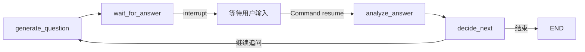

# LangGraph 如何暂停并恢复一个 Agent 任务？

## 一句话结论

LangGraph 的暂停恢复不是“让一个 Python 函数一直阻塞等待”，而是让节点通过 `interrupt()` 返回一个待处理事件，把当前 Graph 状态写入 Checkpointer；外部拿到用户输入后，再使用相同的 `thread_id` 和 `Command(resume=...)` 启动下一次执行。真正决定任务能否跨请求、跨进程恢复的，是稳定的任务标识、可持久化状态和幂等的副作用设计。

## 问题与场景

很多 Agent 都不是一次调用就能完成。例如模拟面试系统需要先生成问题，然后等待用户回答，再继续分析、评分和追问：

```text
生成问题
   ↓
等待用户回答  ← 可能等待几秒、几小时，甚至关闭页面
   ↓
分析回答
   ↓
评分与决定下一步
```

如果直接在后端函数中等待，会遇到明显问题：

- HTTP 请求和工作线程不能无限占用；
- 用户刷新页面后，原连接可能已经断开；
- 服务重启后，内存中的局部变量全部丢失；
- 多个用户同时进行任务时，需要准确找到各自的执行状态；
- 客户端重试提交回答时，可能让同一轮分析执行两次。

因此，Human-in-the-loop Agent 需要的不是普通的“暂停线程”，而是一个**可持久化的状态机暂停点**。

## 一个具体例子

假设面试 Graph 有四个节点：生成问题、等待回答、分析回答和决定下一步。



### 1. 定义可序列化状态

Graph 状态应该保存后续节点真正需要的数据，而不是依赖进程内的临时对象：

```python
from typing import TypedDict


class InterviewState(TypedDict, total=False):
    interview_id: str
    question_id: str
    question: str
    answer: str
    analysis: dict
    round: int
```

这些字段会进入 Checkpoint，因此应尽量使用 JSON 兼容或 Checkpointer 支持序列化的类型。数据库连接、文件句柄和客户端对象不应直接放进状态。

### 2. 在节点中调用 interrupt

等待节点不负责轮询数据库，也不需要一直占用协程。它只负责告诉外部：“执行到这里需要一个回答”。

```python
from langgraph.types import interrupt


def wait_for_answer(state: InterviewState) -> dict:
    answer = interrupt({
        "type": "answer_required",
        "interview_id": state["interview_id"],
        "question_id": state["question_id"],
        "question": state["question"],
    })

    return {"answer": answer}
```

第一次执行到 `interrupt()` 时，Graph 会暂停，并把传入的数据暴露给调用方。此时可以向前端返回当前问题，当前执行不需要继续占用请求。

当任务被恢复时，`interrupt()` 表达式的结果就是外部提交的 resume 值，节点随后返回 `{"answer": answer}`，Graph 再进入分析节点。

这里有一个重要语义：**恢复时节点可能从开头重新执行，而不是从 Python 函数的某一行继续。** 所以 `interrupt()` 之前不应放置不可重复的副作用。

下面这种写法有风险：

```python
def wait_for_answer(state: InterviewState) -> dict:
    send_notification(state["question_id"])  # 恢复时可能再次发送
    answer = interrupt({"question": state["question"]})
    return {"answer": answer}
```

更稳妥的做法是把“生成问题”“记录问题”“通知用户”拆成独立节点，并使用幂等键保证重复执行不会产生第二份业务结果。

### 3. 使用 thread_id 标识一次执行

LangGraph 需要通过 `thread_id` 找到对应的 Checkpoint：

```python
config = {
    "configurable": {
        "thread_id": "interview-int_123"
    }
}

result = graph.invoke(
    {
        "interview_id": "int_123",
        "round": 1,
    },
    config=config,
)
```

`thread_id` 是 Graph 执行身份，不应每次请求都随机生成。对于面试场景，可以由稳定的业务 ID 派生，但要明确两者的职责：

| 标识 | 主要用途 |
| --- | --- |
| `interview_id` | 查询业务数据、鉴权、审计和展示 |
| `thread_id` | 定位 LangGraph Checkpoint 和执行历史 |
| `question_id` | 标识当前轮问题，处理回答幂等 |
| `request_id` | 追踪一次 HTTP 请求或提交动作 |

业务 ID 和 Graph ID 可以相同，也可以建立映射，但不能让客户端任意指定一个 ID 就恢复不属于自己的任务。服务端必须先完成用户身份与任务归属校验。

### 4. 使用 Command 恢复任务

用户提交回答后，后端使用相同的 `thread_id` 恢复：

```python
from langgraph.types import Command


result = graph.invoke(
    Command(resume={
        "question_id": "q_007",
        "content": "我使用事务性发件箱解决数据库与消息投递的一致性。",
    }),
    config={
        "configurable": {
            "thread_id": "interview-int_123"
        }
    },
)
```

在实际项目中，不要只传一段裸字符串。结构化 resume 数据可以携带 `question_id`、回答内容、提交时间和幂等键，等待节点再校验恢复数据是否属于当前问题：

```python
def wait_for_answer(state: InterviewState) -> dict:
    payload = interrupt({
        "type": "answer_required",
        "question_id": state["question_id"],
        "question": state["question"],
    })

    if payload["question_id"] != state["question_id"]:
        raise ValueError("Answer does not match the current question.")

    return {"answer": payload["content"]}
```

这可以避免旧页面、重复请求或并发标签页把上一轮回答提交到当前轮。

### 5. Checkpointer 决定恢复范围

编译 Graph 时需要配置 Checkpointer：

```python
graph = builder.compile(checkpointer=checkpointer)
```

不同存储方式提供的保证不同：

| Checkpointer | 适用场景 | 主要限制 |
| --- | --- | --- |
| 内存存储 | 本地开发、单元测试 | 进程退出后状态丢失，不能跨实例共享 |
| SQLite | 单机原型、轻量任务 | 多实例部署和高并发能力有限 |
| PostgreSQL | 生产环境、多实例服务 | 需要迁移、连接池、备份和清理策略 |

如果生产环境仍使用内存 Checkpointer，那么“浏览器刷新后恢复”可能成功，但“服务重启后恢复”仍然会失败。暂停恢复能力必须按故障边界验证，不能只看正常请求流程。

## 暂停恢复不等于业务数据持久化

Checkpoint 保存的是 Graph 执行状态，但业务系统通常还需要独立保存问题、回答、评分和报告：

```text
业务数据库
  保存：面试、问题、回答、评分、报告、幂等记录

LangGraph Checkpoint
  保存：当前节点、Graph State、下一步执行位置
```

两者解决的问题不同：

- 业务数据库是产品事实来源，支持查询、审计和报表；
- Checkpoint 是工作流执行快照，支持暂停、恢复和重放；
- 只有 Checkpoint，没有业务落库，页面和报表很难稳定查询；
- 只有业务落库，没有 Checkpoint，恢复时需要手工重建 Graph 状态。

生产系统通常要设计一条重建路径：如果 Checkpoint 不可用，能否根据已经持久化的问题、回答和任务状态构造新的 Graph State，并从安全节点继续执行。

## 实践建议

1. **把 interrupt 当成状态机边界。** 在等待人工输入、审批、付款或外部回调的位置暂停，不要为了普通函数复用而随意加入暂停点。
2. **保证 interrupt 之前的操作可重放。** 节点恢复时可能重新执行前置代码；发消息、扣款和写外部系统必须拆分或使用稳定幂等键。
3. **持久化 Checkpointer。** 生产环境使用可跨进程、跨实例访问的存储，并测试服务重启后的恢复行为。
4. **稳定管理 thread_id。** 建立 `user_id → business_id → thread_id` 的归属关系；恢复前先鉴权，不能仅凭客户端传来的 thread ID 执行任务。
5. **校验恢复数据对应当前暂停点。** resume payload 带上 `question_id` 或 `interrupt_id`，拒绝过期、错轮次和重复提交。
6. **业务状态与执行状态分开保存。** Checkpoint 不能替代业务数据库，业务表也不能自动替代工作流快照。
7. **为回答提交设计幂等。** 使用 `interview_id + question_id` 或客户端生成的幂等键建立唯一约束，重复请求返回已有结果。
8. **测试真实故障，而不只测试正常恢复。** 至少覆盖页面刷新、重复提交、旧问题提交、服务重启、两个实例恢复同一任务和 Checkpoint 不可用等场景。

## 延伸阅读

- [LangGraph：Interrupts](https://docs.langchain.com/oss/python/langgraph/interrupts)
- [LangGraph：Persistence](https://docs.langchain.com/oss/python/langgraph/persistence)
- [LangGraph：Human-in-the-loop](https://docs.langchain.com/oss/python/langgraph/human-in-the-loop)
- [问鉴：可暂停、可恢复的 Agent Loop](/projects/wenjian#可暂停、可恢复的-agent-loop)
- [每日技术：为什么 Agent 流式输出适合使用 SSE](/daily/2026/08/2026-08-03-daily-SSE)
