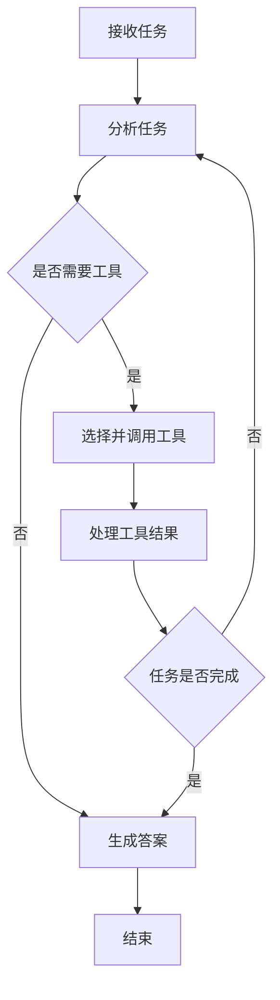
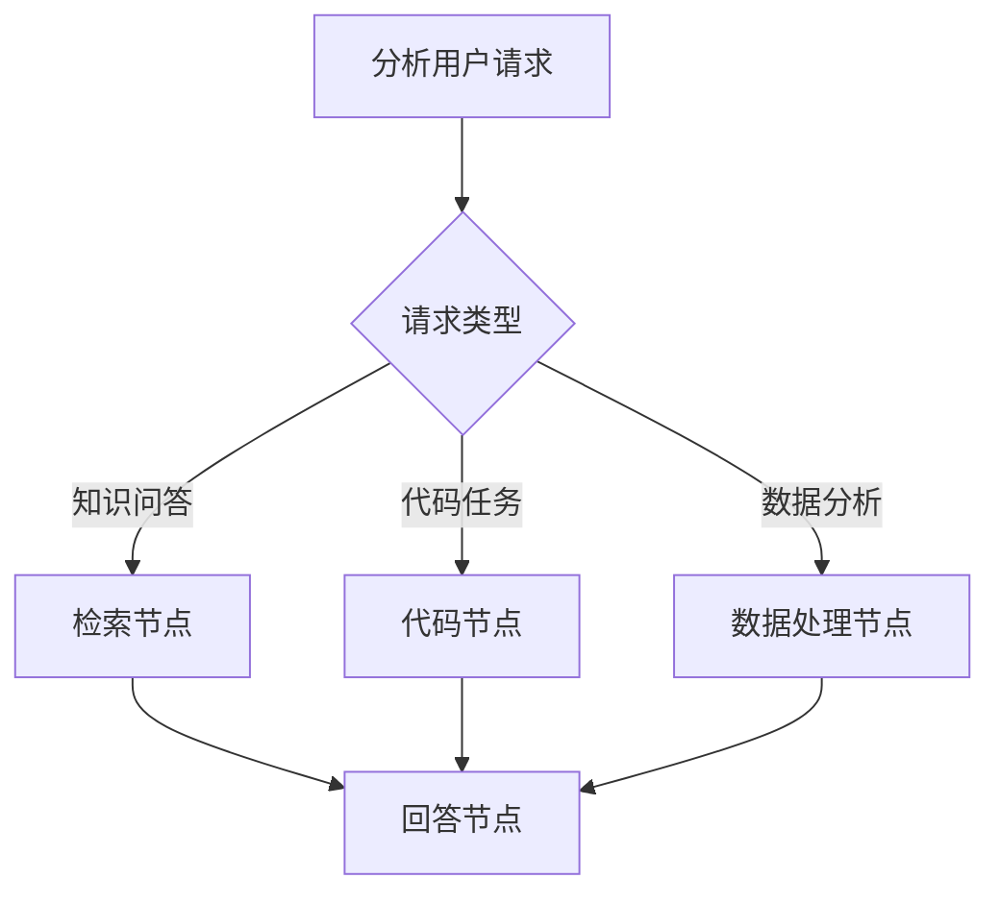
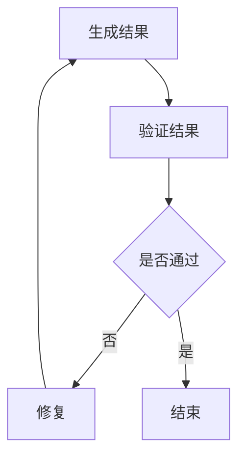
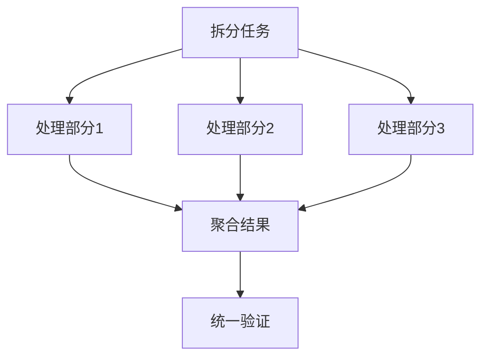
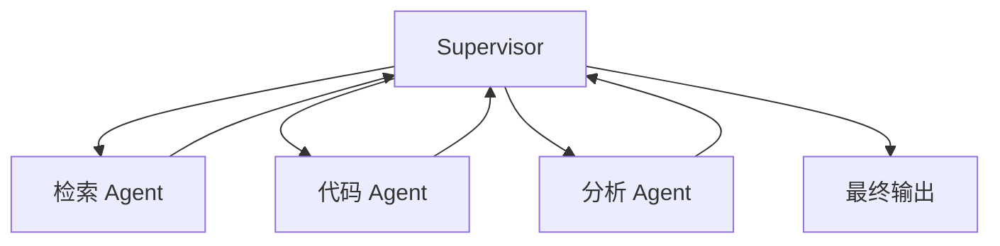
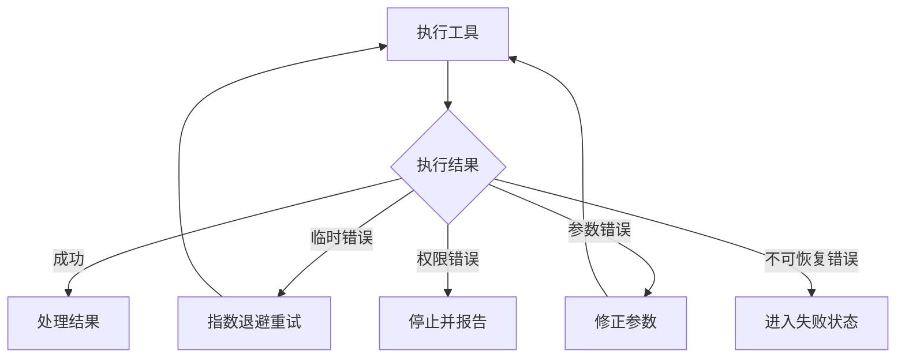
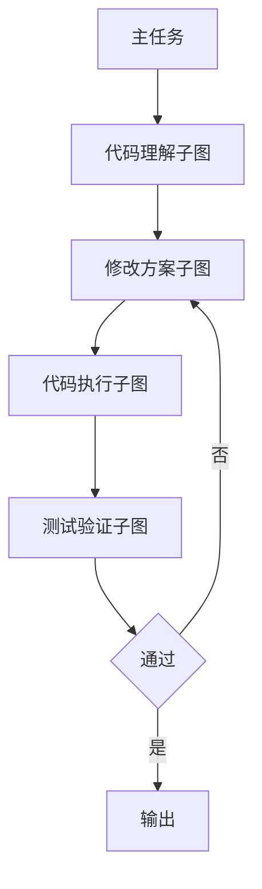
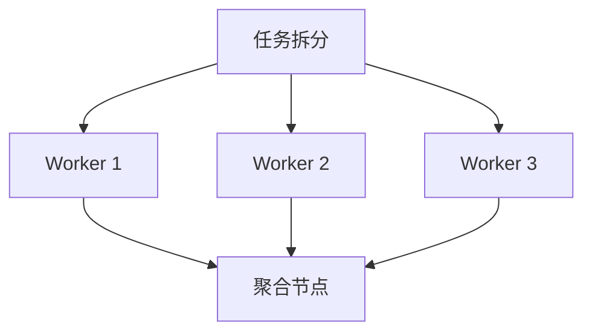

# Agent Graph

> Agent Graph 将隐式控制流变成显式结构，使系统更容易理解、调试、测试、监控、限制、恢复和审计。

> 让模型在环境反馈的基础上不断调整行为，直到满足任务完成条件。
## 1. 什么是 Agent Graph

Agent Graph 是一种显式图结构的控制流模型。

图中的基本元素包括：

- **节点 Node**：执行一个具体步骤；
- **边 Edge**：表示节点之间的流转关系；
- **条件边 Conditional Edge**：根据状态决定进入哪个节点；
- **状态 State**：在节点之间传递的数据；
- **入口 Entry Point**：任务从哪里开始；
- **终点 End Node**：任务在哪里结束；
- **子图 Subgraph**：可复用的局部工作流；
- **检查点 Checkpoint**：保存图运行到某一步时的状态。

一个简单的 Agent Graph 可以表示为：



Agent Graph 可以是：

- 有向无环图 DAG；
- 有条件分支的状态机；
- 包含循环边的有向图；
- 多 Agent 协作图；
- 动态生成的执行图。
## 2. Agent Graph 不是知识图谱

“Agent Graph”中的 Graph 指的是**控制流图**，而不是知识图谱。

两者的区别如下：

| 类型        | 节点表示                      | 边表示             | 主要目标              |
| ----------- | ----------------------------- | ------------------ | --------------------- |
| Agent Graph | 推理步骤、工具、Agent、验证器 | 执行顺序、条件转移 | 控制 Agent 的运行过程 |
| 知识图谱    | 实体、概念、事件              | 实体之间的语义关系 | 存储和查询知识        |
| 计算图      | 数学运算                      | 张量依赖关系       | 自动微分和数值计算    |
| 工作流图    | 业务任务                      | 任务依赖关系       | 业务流程编排          |

Agent Graph 中也可以调用知识图谱，但二者不是同一个概念。
终止判断不应完全依赖模型。
## 3. Agent Graph 的基本组成

### 3.1 节点 Node

节点是 Agent Graph 中最小的执行单元。

节点可以是：

- LLM 推理节点；
- 工具调用节点；
- 路由节点；
- 验证节点；
- 状态转换节点；
- 人工审批节点；
- 数据清洗节点；
- 子 Agent 节点；
- 输出生成节点。

一个好的节点应该：

- 职责单一；
- 输入输出明确；
- 容易单独测试；
- 错误边界清晰；
- 尽量保证幂等；
- 不依赖不必要的全局状态。
### 3.2 边 Edge

边表示节点之间的流转关系。

普通边：

```text
A → B
```

条件边：

```text
A → 条件判断 → B / C / D
```

循环边：

```text
A → B → C → A
```

错误边：

```text
工具节点失败 → 重试节点 / 降级节点 / 人工处理节点
```

工程上应显式定义错误流向，而不是只定义成功路径。
### 3.3 路由函数 Router

路由函数根据 State 决定下一个节点。

例如：

```python
def route_after_reasoning(state):
    decision = state["decision"]

    if decision["action"] == "call_tool":
        return "tool_executor"

    if decision["action"] == "finish":
        return "finalizer"

    if decision["action"] == "ask_human":
        return "human_approval"

    return "error_handler"
```

路由函数最好是确定性的。

如果路由由 LLM 完成，LLM 的输出也应被限制在枚举值中：

```python
Route = Literal[
    "tool_executor",
    "planner",
    "validator",
    "finalizer"
$$
```
### 3.4 图状态 State

图状态是在不同节点之间传递的共享数据。

状态模型可以分成三层：

### 3.5 任务级状态

生命周期覆盖整个任务：

```text
任务目标、用户约束、最终产物、总体预算
```

### 3.6 阶段级状态

生命周期覆盖一个子流程：

```text
当前计划、当前子任务、阶段结果、阶段错误
```

### 3.7 节点级临时状态

只在当前节点使用：

```text
模型响应、工具参数、中间解析结果
```

避免把所有临时变量都写入全局 State，否则会造成状态污染。
### 3.8 Reducer

在并发节点或多个分支同时修改状态时，需要定义合并规则。

例如：

```python
class GraphState:
    findings: Annotated[list[str], add]
    errors: Annotated[list[str], add]
    metadata: dict
```

常见 Reducer 规则包括：

- 覆盖：保留最新值；
- 追加：将结果加入列表；
- 集合合并：自动去重；
- 最大值：保留最大版本号；
- 状态机转移：只允许合法状态变化；
- 自定义冲突解决。

没有明确 Reducer 时，并发图容易出现：

- 后写覆盖前写；
- 更新丢失；
- 顺序不确定；
- 数据重复。
### 3.9 入口和终点

每个 Graph 应明确：

```text
ENTRY → 第一个节点
```

以及：

```text
某个节点 → END
```

不能假设“没有下一条边就自然结束”。

明确终点有利于：

- 统计任务成功率；
- 区分正常终止与异常中断；
- 触发清理逻辑；
- 写入最终检查点；
- 生成最终输出。
### 3.10 子图 Subgraph

复杂 Graph 不应将所有节点放在一张大图中。

可以拆成：

```text
主图
├── 检索子图
├── 代码执行子图
├── 内容验证子图
├── 人工审批子图
└── 输出生成子图
```

子图的优点包括：

- 降低复杂度；
- 提高复用性；
- 独立测试；
- 独立配置权限；
- 独立设置预算；
- 方便局部替换。
## 4. 常见 Agent Graph 模式

### 4.1 线性图

```text
输入 → 分析 → 执行 → 验证 → 输出
```

适合流程基本固定的任务。

优点是简单、稳定、容易测试。
### 4.2 条件路由图



适合一个入口处理多种任务类型。
### 4.3 循环图



需要严格设置最大循环次数。
### 4.4 Map-Reduce 图

将大任务拆成多个并行任务：



适合：

- 多文档总结；
- 多文件代码分析；
- 多数据源查询；
- 多候选方案生成；
- 批量评估。

需要注意：

- 分片之间是否独立；
- 聚合时是否丢失信息；
- 并发调用是否超过限流；
- 各分支状态如何合并。
### 4.5 Supervisor–Worker 图

Supervisor 负责分派任务，Worker 负责执行。



Supervisor 不应无限自由地创建任务。

应限制：

- 可调用的 Worker 列表；
- 每个 Worker 的职责；
- 最大分派次数；
- 是否允许 Worker 相互调用；
- 状态返回格式；
- 任务完成协议。
### 4.6 层级式多 Agent 图

复杂任务可以采用多层结构：

```text
总控 Agent
├── 研究组
│   ├── 搜索 Agent
│   └── 文献分析 Agent
├── 工程组
│   ├── 架构 Agent
│   └── 代码 Agent
└── 审核组
    ├── 事实核验 Agent
    └── 格式审核 Agent
```

层级式结构容易出现过度设计。

如果单 Agent 加几个工具就能完成，不应为了“多 Agent”而增加复杂度。
### 4.7 状态机图

将任务状态显式限制为有限集合：

```text
CREATED
→ PLANNING
→ RUNNING
→ WAITING_FOR_HUMAN
→ VALIDATING
→ COMPLETED / FAILED / CANCELLED
```

合法转移例如：

```python
ALLOWED_TRANSITIONS = {
    "CREATED": {"PLANNING", "CANCELLED"},
    "PLANNING": {"RUNNING", "FAILED", "CANCELLED"},
    "RUNNING": {
        "VALIDATING",
        "WAITING_FOR_HUMAN",
        "FAILED",
        "CANCELLED",
    },
    "VALIDATING": {"COMPLETED", "RUNNING", "FAILED"},
}
```

状态机可以避免模型随意生成非法状态。
应停止任务并报告。
## 5. 如何设计 Agent Graph

### 5.1 从职责而不是 Prompt 划分节点

错误划分方式：

```text
节点1：Prompt A
节点2：Prompt B
节点3：Prompt C
```

更好的方式：

```text
节点1：任务分类
节点2：任务规划
节点3：工具执行
节点4：结果验证
节点5：最终生成
```

节点应对应稳定的工程职责，而不是某段 Prompt。
### 5.2 将确定性逻辑移出 LLM

以下逻辑不应该让 LLM 判断：

- 数值是否超过阈值；
- JSON 是否符合 Schema；
- 文件是否存在；
- 用户是否有权限；
- 是否达到最大循环次数；
- HTTP 状态码是否为成功；
- 测试是否通过；
- 哈希是否一致。

应该使用普通代码：

```python
if tool_result.status_code == 200:
    return "process_result"
return "error_handler"
```

LLM 应主要处理：

- 语义理解；
- 模糊分类；
- 任务分解；
- 非结构化信息判断；
- 自然语言生成。
### 5.3 显式设计失败路径

设计图时，不仅画 Happy Path：

```text
A → B → C → 完成
```

还要设计：

```text
B 超时怎么办？
C 验证失败怎么办？
状态写入失败怎么办？
用户取消怎么办？
人工长时间未审批怎么办？
```

一个更完整的结构是：


### 5.4 控制图的动态程度

Agent Graph 可以分为三种控制程度。

### 5.5 静态图

节点和边完全预定义。

优点是稳定、易测试。

### 5.6 半动态图

节点固定，但路由由模型决定。

这是比较常见的工程选择。

### 5.7 动态图

模型可以创建新节点、任务和依赖关系。

灵活但风险高，容易出现：

- 图无限扩张；
- 重复任务；
- 循环依赖；
- 预算失控；
- 难以重放。

通常应优先选择静态图或半动态图。
### 5.8 用子图隔离复杂性

例如一个代码开发 Agent：



每个子图内部可以有自己的：

- State；
- 工具；
- 预算；
- 错误处理；
- 检查点；
- 权限。

## 6. 并发、多 Agent 与任务调度

### 6.1 哪些任务可以并发

只有相互独立的任务适合并发。

例如：

```text
同时分析三个独立文件
同时检索三个不同主题
同时生成三个候选方案
```

存在依赖时应顺序执行：

```text
读取配置
→ 根据配置选择数据库
→ 查询数据库
```
### 6.2 并发的收益

总耗时近似为：

$$
$$ T_{\text{serial}}

\sum_{i=1}^{n}T_i
$$
`

并发时：

$$
T_{\text{parallel}}
\approx
\max(T_1,T_2,\ldots,T_n)
+
T_{\text{overhead}}
$$

但并发会增加：

- 限流风险；
- 状态冲突；
- 结果聚合难度；
- 成本瞬时峰值；
- 调试复杂度。
### 6.3 Fan-out / Fan-in



聚合节点需要解决：

- 重复信息；
- 相互矛盾；
- 分支失败；
- 输出格式不同；
- 部分结果缺失。
### 6.4 部分失败

多分支并发时，不应默认一个分支失败就让全部任务失败。

可配置：

```python
success_policy = {
    "mode": "minimum_success_count",
    "required": 2,
    "total": 3,
}
```

或者：

```text
检索分支失败可以降级；
权限检查分支失败必须终止。
```
### 6.5 多 Agent 通信

多 Agent 之间应使用结构化消息：

```json
{
  "sender": "planner",
  "receiver": "code_agent",
  "task": "分析认证模块",
  "constraints": [
    "不要修改文件"
  ],
  "expected_output": {
    "type": "analysis_report"
  }
}
```

不应让多个 Agent 通过无限自由对话自行协商，否则容易：

- 讨论偏离任务；
- 重复劳动；
- 无法判断谁负责；
- 消耗大量 Token；
- 难以终止。
### 6.6 简化版 Agent Graph

```python
from __future__ import annotations

from dataclasses import dataclass, field
from typing import Any, Callable, Literal


NodeName = Literal[
    "planner",
    "tool_executor",
    "validator",
    "finalizer",
    "error_handler",
    "end",
$$


@dataclass
class GraphState:
    task: str
    current_node: NodeName = "planner"
    plan: list[str] = field(default_factory=list)
    decision: dict[str, Any] = field(default_factory=dict)
    tool_result: dict[str, Any] | None = None
    validation: dict[str, Any] | None = None
    final_answer: str | None = None
    step_count: int = 0
    errors: list[str] = field(default_factory=list)


NodeFunction = Callable[[GraphState], GraphState]


def planner_node(state: GraphState) -> GraphState:
    # 实际项目中调用 LLM 生成结构化决策。
    state.decision = {
        "action": "call_tool",
        "tool_name": "example_tool",
        "arguments": {},
    }
    return state


def tool_executor_node(state: GraphState) -> GraphState:
    try:
        state.tool_result = {
            "success": True,
            "data": "example result",
        }
    except Exception as exc:
        state.errors.append(str(exc))
    return state


def validator_node(state: GraphState) -> GraphState:
    state.validation = {
        "passed": bool(state.tool_result),
    }
    return state


def finalizer_node(state: GraphState) -> GraphState:
    state.final_answer = "任务完成"
    return state


def error_handler_node(state: GraphState) -> GraphState:
    state.final_answer = "任务执行失败：" + "; ".join(state.errors)
    return state


NODES: dict[NodeName, NodeFunction] = {
    "planner": planner_node,
    "tool_executor": tool_executor_node,
    "validator": validator_node,
    "finalizer": finalizer_node,
    "error_handler": error_handler_node,
}


def route(state: GraphState) -> NodeName:
    if state.current_node == "planner":
        action = state.decision.get("action")

        if action == "call_tool":
            return "tool_executor"

        if action == "finish":
            return "finalizer"

        return "error_handler"

    if state.current_node == "tool_executor":
        if state.errors:
            return "error_handler"
        return "validator"

    if state.current_node == "validator":
        if state.validation and state.validation["passed"]:
            return "finalizer"
        return "planner"

    if state.current_node in {
        "finalizer",
        "error_handler",
    }:
        return "end"

    return "error_handler"


def run_graph(
    state: GraphState,
    max_steps: int = 10,
) -> GraphState:
    while state.current_node != "end":
        if state.step_count >= max_steps:
            state.errors.append("max_steps_exceeded")
            state.current_node = "error_handler"

        node = NODES.get(state.current_node)

        if node is None:
            state.errors.append(
                f"unknown_node:{state.current_node}"
            )
            state.current_node = "error_handler"
            continue

        state = node(state)
        state.step_count += 1
        state.current_node = route(state)

    return state
```

真实项目中应继续增加：

```text
Graph Schema
Checkpoint Store
Event Log
Tool Registry
Permission Manager
Retry Policy
Budget Manager
Context Builder
Model Gateway
Human Approval
Observability
```
### 6.7 带重试的工具执行器

```python
import time
from dataclasses import dataclass
from typing import Any, Callable


@dataclass
class ToolExecutionError(Exception):
    error_type: str
    message: str
    retryable: bool = False


def execute_with_retry(
    function: Callable[..., Any],
    arguments: dict[str, Any],
    max_attempts: int = 3,
    base_delay: float = 0.5,
) -> Any:
    last_error: Exception | None = None

    for attempt in range(1, max_attempts + 1):
        try:
            return function(**arguments)

        except ToolExecutionError as exc:
            last_error = exc

            if not exc.retryable:
                raise

            if attempt == max_attempts:
                break

            delay = base_delay * (2 ** (attempt - 1))
            time.sleep(delay)

        except Exception as exc:
            # 未分类异常默认不自动重试，避免重复副作用。
            raise ToolExecutionError(
                error_type="unknown",
                message=str(exc),
                retryable=False,
            ) from exc

    raise ToolExecutionError(
        error_type="retry_exhausted",
        message=str(last_error),
        retryable=False,
    )
```

需要注意：

> 写操作不能因为“出现异常”就自动重试，必须先确认第一次操作是否实际生效。
## 7. 工程化设计流程

设计一个 Agent Loop / Graph 时，可以按照以下顺序进行。

### 7.1 明确任务

回答：

- Agent 要解决什么问题？
- 输入和输出是什么？
- 成功标准是什么？
- 哪些事情明确不做？
- 是否真的需要 Agent？
### 7.2 划分确定性与非确定性部分

例如：

| 步骤                 | 类型     | 实现       |
| -------------------- | -------- | ---------- |
| 检查文件是否存在     | 确定性   | 普通代码   |
| 判断哪个文件最相关   | 非确定性 | LLM        |
| 读取文件             | 确定性   | 工具       |
| 判断内容是否回答问题 | 非确定性 | LLM 或规则 |
| 校验 JSON            | 确定性   | Schema     |
### 7.3 定义 State

为每个字段回答：

- 谁写入？
- 谁读取？
- 是否持久化？
- 是否进入模型上下文？
- 是否包含敏感信息？
- 如何合并？
- 如何清理？
### 7.4 定义节点

每个节点写清：

```text
名称：
职责：
输入：
输出：
允许修改的状态字段：
可调用工具：
超时：
重试：
失败去向：
是否有副作用：
```
### 7.5 定义边和路由

为每条边写明条件：

```text
validator → finalizer
条件：validation.passed == true

validator → planner
条件：validation.passed == false
且 retry_count < max_retry

validator → error_handler
条件：retry_count >= max_retry
```
### 7.6 定义预算

至少配置：

```yaml
max_steps: 12
max_llm_calls: 8
max_tool_calls: 10
max_consecutive_errors: 3
timeout_seconds: 300
```
### 7.7 定义检查点

明确：

- 保存到哪里；
- 什么时候保存；
- 保留多长时间；
- 如何恢复；
- 如何迁移旧版本；
- 如何防止重复副作用。
### 7.8 定义 Trace

至少能够回答：

```text
任务为什么走到这个节点？
模型为什么选择这个工具？
工具返回了什么？
状态在哪一步发生变化？
为什么任务停止？
```
### 7.9 定义测试

包括：

- 节点测试；
- 路由测试；
- 工具契约测试；
- 故障注入；
- 端到端测试；
- 多次运行稳定性测试；
- 成本和延迟测试。
## 8. Agent Loop / Graph 与其他工程思想的关系