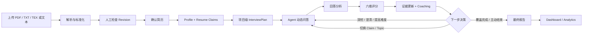
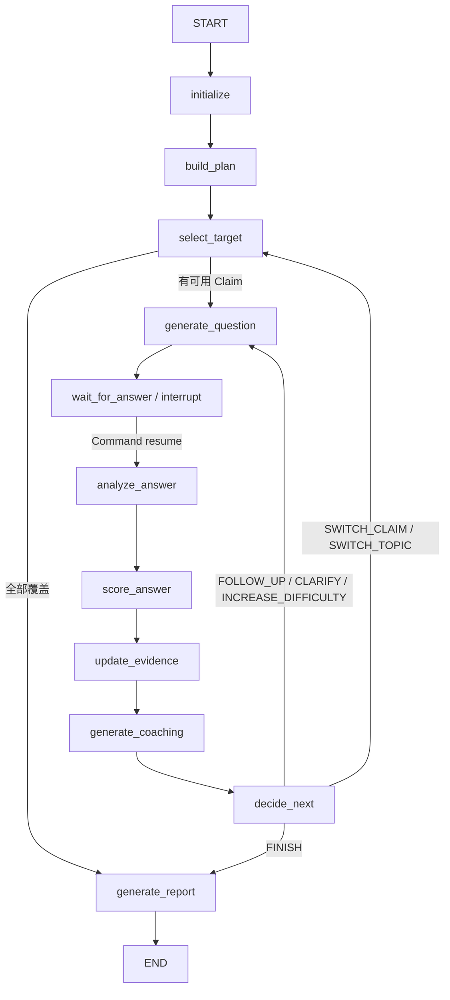

# 生产级 Agent 完整案例：Wenjian

> 本章基于 [liquidweb9/Wenjian](https://github.com/liquidweb9/Wenjian) 当前公开代码与文档整理。它描述的是仓库已经实现的链路、明确记录的运行边界，以及从当前实现走向生产部署仍需完成的工作；不把规划项写成现成功能，也不虚构线上指标。

---

## 1. 案例定位

问鉴（Wenjian）是一款以简历事实为起点、以证据验证为主线的 AI 深度面试平台。它面对的核心问题不是“根据技术关键词生成若干题目”，而是验证候选人简历中的项目主张：

- 候选人具体负责了什么；
- 是否理解代码、接口与数据流；
- 为什么选择某种架构，代价是什么；
- 是否经历过故障、监控、性能和恢复问题；
- 回答中的主张能否被后续细节支持，是否存在矛盾。

系统因此不能使用固定题库流程。每轮回答后，它需要在继续深挖、澄清、提高难度、切换 Claim、切换项目和结束面试之间做出决定。

仓库当前已经完成从简历上传到最终报告的端到端链路，详细实现边界见项目的 [当前实现说明](https://github.com/liquidweb9/Wenjian/blob/main/docs/current-implementation.md)。

## 2. 已实现的产品链路



这条链路包含四个相互关联但职责不同的阶段：

1. **事实建模**：将非结构化简历转换为可编辑、可确认的文档、Profile 和 Claims；
2. **面试规划**：按项目或经历组织 Topic，配置目标深度、问题预算和验证点；
3. **证据循环**：提问、分析、评分、更新证据、生成辅导并决定下一步；
4. **结果聚合**：生成能力分、逐题详情、Claim 状态、矛盾、覆盖率和自然语言报告。

## 3. 技术架构与代码边界

| 层级 | 当前技术 | 主要职责 |
| --- | --- | --- |
| Web | React 19、TypeScript、Vite、Tailwind CSS 4 | 简历管理、面试工作台、报告和分析 |
| Client State | TanStack Query、Zustand、LocalStorage | 服务端缓存、交互状态、草稿和待提交恢复 |
| API | FastAPI、Pydantic、SSE | REST API、结构化契约和业务阶段事件 |
| Agent | LangGraph、规则路由、LLM Gateway | 计划、提问、分析、评分、证据和决策 |
| Data | SQLAlchemy 2 Async、PostgreSQL、Checkpoint | 简历、问答、评价、报告和运行状态 |
| Quality | Pytest、Ruff、TypeScript、ESLint | 测试、静态检查与前端构建 |

仓库的核心目录也反映了这种分层：

```text
app/
├── api/v1/          # FastAPI、SSE 与报告接口
├── interview/       # LangGraph、节点、路由与评分
├── resume/          # Profile、Claim 构建与排序
├── parsers/         # PDF / TXT / TEX 解析
├── llm/             # 模型路由、重试与 Token 预算
├── persistence/     # 数据模型、Repository 与 Checkpoint
└── observability/   # 日志、指标与追踪

frontend-react/      # React 主前端
migrations/          # Alembic 数据库迁移
tests/               # 后端测试
docs/                # 产品、API、Graph 与前端说明
```

模型使用 OpenAI-compatible API 接入。应用代码通过 LLM Gateway 隔离具体供应商，Pydantic 模型承担结构化输出契约。

## 4. 简历、Profile 与 Claim

### 4.1 简历不是一次性 Prompt 附件

上传文件后，系统保存的不只是解析文本，而是包含原始文本、标准化文本、块结构、解析器信息、质量分和警告的 `ResumeDocument`。用户可以修改尚未确认的 Revision；保存修改时重新构建 Blocks，确认后才触发 Profile Builder 和 Claim Extractor。

这种设计把“机器解析结果”和“用户确认事实”分开。未经确认的解析内容不能直接成为高可信面试依据。

### 4.2 Profile

Profile 将教育、工作、项目、研究、竞赛和技能组织成结构化经历。它负责回答“候选人的简历由哪些可寻址对象组成”，为后续 Topic、Claim 和证据引用提供稳定标识。

### 4.3 Resume Claim

Claim 表示需要通过面试验证的简历主张，包含来源 Entry、相关技术、期望能力等级、Verification Points、风险标记、优先级和置信度。Claim 可以启用、停用和调整优先级。

系统不会把每个技术词直接变成一道题。同一项目的多个 Claim 会被合并理解，一个 Topic 对应一段项目、工作或研究经历。这样的问题更接近真实工程上下文，而不是孤立知识点问答。

## 5. InterviewPlan 与问题预算

`build_plan` 从包含 Claim 的项目、工作和研究经历中建立 Topics：

- Topic 按其中 Claim 的最高优先级排序；
- 每个 Topic 记录相关 Claims、考察维度和目标深度；
- 根据总轮次与项目数量分配最小/最大问题数；
- Required Dimensions 包含项目概览、个人贡献、架构、生产和权衡。

默认最大轮次是 15，前端允许配置 3–30 轮。`max_turns` 是防止 Agent 无界执行的硬预算，而不是固定题目数量。系统可以在所有 Claims 已覆盖或用户主动结束时提前完成。

## 6. 真实的 11 节点 Agent Graph

仓库当前 Graph 的节点和顺序如下，详见 [Agent Loop 与决策机制](https://github.com/liquidweb9/Wenjian/blob/main/docs/agent-loop.md)：



这里有两个重要的工程选择：

1. LLM 负责理解回答、生成问题和结构化评价，代码负责关键路由；
2. Graph 在 `wait_for_answer` 使用 LangGraph `interrupt()` 暂停，而不是让一个 HTTP 请求阻塞整个访谈。

提交回答时，API 使用以下语义恢复 Graph：

```python
Command(resume={"answer_text": "用户回答"})
```

这使“等待数分钟或数小时的人类输入”成为显式状态，而不是异常或进程内回调。

## 7. InterviewState

当前 Graph State 分为六组：

| 分类 | 关键字段 |
| --- | --- |
| 标识 | `interview_id`、`thread_id`、`resume_id`、`resume_revision_id` |
| 配置 | `target_role`、`job_description`、`interview_mode`、`max_turns` |
| 简历输入 | `resume_profile`、`resume_claims`、`interview_plan` |
| 当前目标 | `current_topic_id`、`current_claim_id`、`current_verification_point_id`、`current_depth`、`current_question` |
| 历史与证据 | `questions`、`answers`、`analyses`、`evaluations`、`claim_statuses`、`contradictions`、`evidence_items`、`coverage`、`ability_profile` |
| 流程与输出 | `turn_count`、`next_action`、`stop_reason`、`finished`、`latest_coaching`、`final_report` |

`thread_id` 同时作为业务会话标识和 LangGraph Checkpoint Config。状态中明确区分当前目标、历史证据和最终输出，因此后续问题不必仅依赖一段不断增长的聊天文本。

## 8. 节点职责

### 8.1 initialize

初始化历史、Claim Status、Evidence、Coverage 和流程字段，并为每个 Resume Claim 建立可跟踪状态。

### 8.2 select_target

目标选择按以下顺序进行：未解决矛盾、最高优先级未完成 Claim、尚未验证的 Verification Point。Verification Point 的 `target_depth` 作为初始深度；没有可选 Claim 时结束面试。

### 8.3 generate_question

第一题用于建立项目目标、架构、端到端流程和个人职责。后续问题结合历史回答，追问设计决策、实现细节、失败场景、边界与权衡。

模型输出 `InterviewQuestion`，其中包含 Topic/Claim、深度、Expected Points、强弱信号、红旗和候选追问。Expected Points 是内部证据线索，不直接展示给正在作答的用户。

### 8.4 analyze_answer

`AnswerAnalysis` 记录回答摘要、技术点、个人贡献证据、已覆盖/部分覆盖/缺失的 Expected Points、模糊表述、可能错误、矛盾、相关度、信息密度和建议追问目标。

### 8.5 score_answer

`AnswerEvaluation` 产生六维评分、各维理由、回答证据、缺失点、置信度、优势、事实错误、无证据主张和 Demonstrated Level。模型可以建议下一动作与深度，但不拥有最终路由权。

### 8.6 update_evidence

当前实现为每题生成 `EvidenceItem`，证据文本最多保留 500 字。Verification Point 根据覆盖与缺失情况更新为 Verified、Partial 或 Missing；Claim Status 根据验证点和矛盾更新。

### 8.7 generate_coaching

Coaching 输出考察意图、优点、改进项、简洁/完整/专家级答案、回答框架、可能追问和知识缺口。它区分：候选人已经确认的事实、仍需确认的内容、通用技术知识。

如果 LLM 调用失败，系统会根据已经获得的 Evaluation 和 Analysis 生成确定性兜底 Coaching。

### 8.8 generate_report

报告生成时，确定性 Summary 是权威指标，LLM 负责组织自然语言正文。系统区分 Questions Asked 与 Questions Answered，用户主动结束产生的结束标记不计为零分回答。即使 LLM 报告生成失败，仍会返回基础 Summary。

## 9. 七级深度模型

| 深度 | 关注点 |
| ---: | --- |
| 1 | 背景、目标、职责 |
| 2 | 执行流程、端到端链路 |
| 3 | 代码、接口、数据结构 |
| 4 | 原理和设计理由 |
| 5 | 边界、故障、重试、并发 |
| 6 | 备选方案和权衡 |
| 7 | 反事实、演进和重新设计 |

深度模型的价值在于把“追问”变成可解释的能力梯度。高分并不直接意味着完成：当总分达到阈值且尚未到达深度 7，系统可能提高难度，验证回答是否能在更严格的工程条件下成立。

## 10. 确定性决策规则

`decide_next` 是代码控制的规则引擎，当前优先级为：

| 优先级 | 条件 | 动作 | Reason |
| ---: | --- | --- | --- |
| 0 | 外部请求结束 | `FINISH` | 外部传入 |
| 1 | `turn_count >= max_turns` | `FINISH` | `MAX_TURNS` |
| 2 | 存在未解决矛盾 | `FOLLOW_UP` | `CONTRADICTION` |
| 3 | 回答相关度 `< 0.35` | `CLARIFY` | `LOW_RELEVANCE` |
| 4 | 实现深度 `< 60` 且当前深度 `<= 3` | `FOLLOW_UP` | `LOW_IMPLEMENTATION` |
| 5 | 加权总分 `>= 80` 且深度 `< 7` | `INCREASE_DIFFICULTY` | `HIGH_SCORE` |
| 6 | Claim 已完成、不支持或矛盾 | `SWITCH_CLAIM` | `CLAIM_DONE` |
| 7 | 达到 Topic 问题上限 | `SWITCH_CLAIM` | `QUESTION_LIMIT` |
| 8 | 其他情况 | `FOLLOW_UP`，深度 +1 | `CONTINUE_DEEPENING` |

这组规则体现了“概率性理解、确定性控制”的 Harness 思路。模型评分仍可能有偏差，但它不能直接跳过最大轮次、忽略矛盾或擅自结束流程。

需要注意，`0.35`、`60` 和 `80` 是当前代码策略阈值，不是普适行业标准。生产发布前应通过标注数据集评估其 Precision/Recall、群体差异和边界样本，再进行版本化调整。

## 11. 六维评分与证据状态

| 维度 | 权重 |
| --- | ---: |
| 技术正确性 `technical_correctness` | 25% |
| 实现深度 `implementation_depth` | 20% |
| 架构与权衡 `architecture_tradeoffs` | 15% |
| 个人贡献 `personal_contribution` | 15% |
| 生产意识 `production_awareness` | 15% |
| 表达清晰度 `clarity` | 10% |

总分采用加权计算，不是六项简单平均。评分结果与 Analysis、Evidence 和 Claim 状态一起使用，避免把一个总分当成全部事实。

当前 Claim 的关键状态包括：

- `IN_PROGRESS`：仍有验证点未覆盖；
- `PARTIALLY_VERIFIED`：已覆盖一部分验证点；
- `VERIFIED`：所有验证点完成；
- `CONTRADICTORY`：出现未解决矛盾；
- 路由文档还会处理不支持的 Claim，并切换到其他目标。

证据账本的作用不是证明模型评价绝对正确，而是让报告读者能够检查“这个结论来自哪一轮回答、覆盖了哪个验证点、是否存在冲突”。

## 12. Prompt 与结构化输出

问题、Analysis、Evaluation、Coaching 和 Report 都通过结构化模型承载。Pydantic 约束保证下游节点读取的是明确字段，而不是从自然语言中猜测分数、动作和状态。

当前设计还通过职责分离降低 Prompt 风险：

- Question Generator 只负责生成当前问题；
- Analyzer 提取回答内容和证据；
- Evaluator 负责六维评分；
- Evidence Node 依据结构化结果更新验证状态；
- Router 使用代码规则选择下一动作；
- Report Node 以确定性 Summary 作为权威输入。

这比让单个 Prompt 同时负责提问、评分、状态更新和终止判断更容易测试与降级。

## 13. Context、Memory 与 RAG 的实际使用边界

当前 Wenjian 的核心 Grounding 来源是用户确认的简历 Profile、Resume Claims、InterviewPlan、历史问答、Analysis、Evaluation 和 Evidence，而不是一个通用外部知识库。

因此本项目更准确的描述是“Resume-grounded Agent”：

- 简历 Revision 提供经过人工确认的初始事实；
- Profile 和 Claims 提供结构化目标；
- Graph State 保存当前访谈工作记忆；
- PostgreSQL 保存简历、问答、评价与报告；
- Evidence 和 Contradiction 支持跨轮一致性；
- Job Description 作为创建面试时的可选目标上下文。

仓库当前文档没有将通用向量 RAG 或跨会话长期用户 Memory 列为已完成核心链路，因此不应在案例中把这些能力写成现成功能。未来若接入企业题库或外部技术资料，需要单独解决检索权限、来源引用、知识时效和间接 Prompt Injection。

## 14. Human-in-the-loop

Wenjian 当前有两个清晰的人机协作点。

第一，简历确认：解析后的标准化文本可由用户编辑，确认 Revision 后才构建 Profile 与 Claims。这防止错误解析直接污染整场面试。

第二，回答等待：Graph 在 `wait_for_answer` 中断并持久化当前问题，用户提交回答后继续。用户还可以主动结束，系统生成已有范围内的报告。

前端的“预期回答”明确标记为强回答示例，并提示它不是候选人已经陈述的项目事实。这是重要的产品边界，避免模型生成的示例被误认为候选人证据。

生产化后仍需要增加的 Human-in-the-loop 能力包括：面试官复核高风险结论、修改或驳回 Claim 状态、查看证据来源、对自动评分提出申诉，以及在正式招聘决策前明确禁止无人审查的自动淘汰。

## 15. 实时事件与长任务体验

前端使用 `fetch + ReadableStream` 消费 SSE。当前传输的是业务阶段事件与完整结构化结果，不是 Token 级流式文本。

主要事件包括：

| SSE Event | 前端行为 |
| --- | --- |
| `interview.initialized` | 等待第一题 |
| `question.ready` | 展示新问题并清理上一轮实时状态 |
| `answer.accepted` | 进入分析状态 |
| `analysis.completed` | 更新处理阶段 |
| `scoring.completed` | 展示评分 |
| `coaching.ready` | 展示辅导和强回答示例 |
| `interview.finished` | 展示完成状态 |
| `report.ready` | 刷新详情并开放报告入口 |

SSE 负责低延迟通知，REST 详情与轮询负责最终状态恢复。这个组合比“只依赖一条永不断开的 SSE 连接”更可靠。

## 16. 持久化、幂等与恢复

### 16.1 已持久化数据

当前已持久化 Resume Source、Revision、Blocks、Profile、Claims、Interview、Questions、Answers、Analysis、Evaluation 和 Report。

面试详情优先读取 Graph State，同时使用数据库中的问题和回答作为耐久兜底。已完成面试以数据库 `status=finished` 作为终态事实源。

### 16.2 Checkpoint 重建

开发环境使用内存 Checkpointer。当内存状态不存在时，`_ensure_graph_checkpoint()` 根据 Questions、Answers、Profile 和 Claims 重建状态，并选择最近一个尚未回答的问题作为 Current Question。

这能恢复已经落库的业务状态，但不能保证恢复尚未完成、尚未落库的 LLM 中间计算。因此它是业务级重建机制，不等同于生产级 Durable Execution。

### 16.3 前端恢复

- SSE 断线按 1、2、4 秒等指数退避，最大间隔 15 秒，最多重试 10 次；
- SSE 重连时服务端发送当前问题或结束状态快照；
- 未完成面试每 5 秒轮询详情；
- 回答草稿使用 `${interviewId}_${questionId}` 保存到 LocalStorage；
- 提交回答时生成稳定 UUID 幂等键，并与 Question ID 一起持久化；
- 刷新后复用原幂等键，确认服务端已保存 Answer 后才清除 Pending 状态。

这些机制共同处理刷新、Tab 挂起、短时断网、SSE 丢事件和重复点击。

## 17. 为什么当前节点不能全部并行

当前依赖链为：

```text
Answer
  -> Analysis
  -> Evaluation（读取 Analysis）
  -> Evidence（读取 Analysis + Evaluation）
  -> Coaching（读取 Analysis + Evaluation）
  -> Decision（读取 Analysis + Evaluation + Evidence）
```

因此不能直接同时启动 Analysis、Evaluation 和 Coaching。盲目并行会让后续节点读取不完整状态，或者产生相互不一致的评分、证据与建议。

仓库记录的可行优化方向包括：

1. 在每个节点开始和结束时发布 SSE Phase Event，先改善进度感知；
2. 在评分完成后将 Evidence Update 与 Coaching 改造成并行分支，再在 Decision 前汇合；
3. 下一题先返回，Coaching 异步补充，但需要处理 UI 状态和一致性；
4. 只对自然语言正文使用 Token Streaming，结构化 Pydantic 输出仍等待完整 JSON 校验。

这些是优化方向，不是当前已经完成的并行架构。

## 18. Evaluation、Testing 与 Observability

仓库已配置 Pytest、Ruff、TypeScript 和 ESLint，并包含后端测试目录与 Observability 模块。项目文档也明确要求运行：

```bash
pytest tests/ -v
pytest tests/ --cov=app
ruff check app tests

cd frontend-react
pnpm type-check
pnpm lint
pnpm build
```

从 Agent Evaluation 角度，还应把以下指标纳入持续回归：

- 简历解析与 Claim 提取准确率；
- 问题与当前 Claim/Verification Point 的相关性；
- 重复问题率与无效追问率；
- Analysis 的证据定位准确率；
- 六维评分与人工标注的一致性；
- `decide_next` 动作准确率和阈值敏感性；
- Claim 状态与人工复核的一致性；
- 报告中结论的证据支撑率；
- 中断、刷新、重复提交和进程重启后的恢复正确性。

仓库当前没有公开生产流量、成本、延迟 SLO 或人工评分一致性数据，因此本章不提供虚构数字。

## 19. 安全与公平性

当前仓库已经采用环境文件保存 LLM Key 和数据库连接，并明确禁止提交凭证。然而项目文档也指出，鉴权仍是占位实现，`GET /me` 固定返回匿名用户。这意味着当前版本适合本地开发与功能验证，不应直接作为多租户生产招聘系统部署。

生产化至少需要补齐：

- 用户、候选人、面试官和管理员的真实身份认证；
- 简历、面试、报告与 Analytics 的租户级授权；
- 文件上传扫描、类型与大小限制；
- 简历和 JD 中间接 Prompt Injection 的数据隔离；
- PII 加密、日志脱敏、保留期限和删除流程；
- 模型供应商的数据处理边界；
- 评分偏差、群体公平性和人工复核机制；
- 对自动招聘决定设置明确的人类审批边界。

“证据驱动”可以提高可解释性，但不能自动消除模型偏差，也不能把六维评分直接视为客观的人才结论。

## 20. 当前限制

根据仓库当前实现说明，已知边界包括：

- 鉴权仍为占位实现；
- 开发环境默认内存 Checkpoint，生产需要耐久 Checkpointer；
- SSE Sequence Counter 位于进程内，重启后重新计数；
- 尚未落库的 LLM 中间计算不能保证恢复；
- 当前不是 Token 级流式生成；
- 报告导出支持 JSON 和基础 Markdown，暂不包含 PDF/DOCX；
- Dashboard/Analytics 直接聚合报告，大数据量时需要汇总表或缓存；
- 自动化端到端浏览器测试和可访问性审计仍需补充；
- Analysis、Evaluation、Evidence、Coaching 和 Decision 受数据依赖限制，不能全部并行。

这份限制清单本身是生产工程的重要组成部分：它把“本地可运行”“具备恢复兜底”和“真正生产级 Durable、多租户、安全部署”区分开来。

## 21. 从当前实现走向生产

### 21.1 Durable Runtime

将内存 Checkpointer 替换为耐久 Checkpointer；为 Graph State、Prompt、模型、Schema 和路由策略保存版本；对节点重试设置幂等键；明确升级后旧 Run 的迁移与恢复策略。

### 21.2 身份与数据治理

落地真实鉴权、租户隔离、RBAC/ABAC、审计日志、PII 加密和删除策略。简历、回答和报告属于高敏感数据，不能只依赖前端路由隐藏。

### 21.3 评估门禁

建立人工标注的 Claim、Analysis、评分和路由数据集；冻结回归集；比较 Prompt、模型和阈值版本；使用金丝雀发布观察质量、成本、延迟和恢复指标。

### 21.4 可观测性与 SLO

用 `interview_id`、`thread_id` 和 request ID 关联 API、Graph Node、模型调用、数据库与 SSE 事件。记录节点耗时、Token、重试、结构化输出失败、恢复来源和终止原因，同时避免在日志中暴露完整简历与回答。

### 21.5 公平与人工决策

对不同岗位、经验年限和表达风格进行分层评估；展示评分证据与置信度；允许面试官修改自动结论；正式招聘判断必须由人作出并记录依据。

## 22. 这个案例体现的 Agent Engineering 原则

Wenjian 当前实现把前 14 章的多个概念连接成了真实系统：

- Prompt 和 Pydantic 定义局部输出契约；
- LangGraph 表达可暂停的长流程；
- 代码规则控制关键路由与终止；
- Profile、Claims、Verification Points 和 Evidence 管理跨轮状态；
- PostgreSQL 与 Checkpoint 支撑持久化和恢复；
- SSE、轮询、快照、本地草稿和幂等键构成长任务 UX；
- 确定性 Summary 和 LLM 正文形成可降级报告；
- 当前限制明确暴露生产化所需的安全、耐久、评估与规模化工作。

最值得借鉴的不是某一个 Prompt 或框架，而是系统把非确定性模型限制在清晰职责内：模型负责语义理解和生成，结构化契约约束数据，规则引擎决定流程，证据状态支持审计，持久化层提供恢复依据，前端让长任务状态对用户可见。

## 23. 参考资料

- [Wenjian GitHub 仓库](https://github.com/liquidweb9/Wenjian)
- [README：产品定位、技术架构与快速开始](https://github.com/liquidweb9/Wenjian/blob/main/README.md)
- [当前实现与产品效果](https://github.com/liquidweb9/Wenjian/blob/main/docs/current-implementation.md)
- [Agent Loop 与决策机制](https://github.com/liquidweb9/Wenjian/blob/main/docs/agent-loop.md)
- [API 接口与预期返回](https://github.com/liquidweb9/Wenjian/blob/main/docs/api-reference.md)
- [React 前端页面与交互](https://github.com/liquidweb9/Wenjian/blob/main/docs/frontend-pages.md)