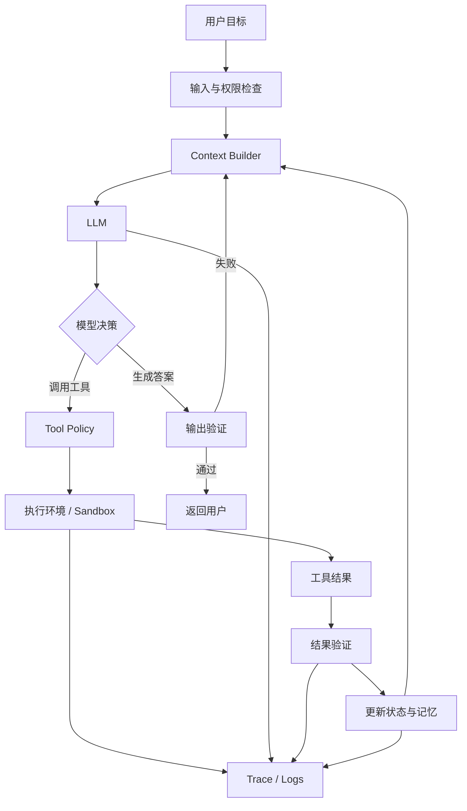

# 从 Prompt Engineering 到 Context Engineering，再到 Harness Engineering

> Prompt Engineering 设计单次模型调用的指令，Context Engineering 决定本轮推理应该看到什么，Harness Engineering 则负责让模型、上下文、工具和状态组成一个可以持续运行的系统。

## 1. 引言：LLM 工程关注点为什么不断扩大

大语言模型应用最初大多采用单轮调用：

```text
用户输入 → Prompt → LLM → 输出
```

在这种模式下，应用效果主要取决于两个因素：

1. 模型本身是否具备完成任务的能力；
2. Prompt 是否准确表达了任务。

因此，早期 LLM 应用开发的重点自然集中在 **Prompt Engineering**。

但是，当应用逐渐加入以下能力后，问题发生了变化：

- 多轮对话；
- 文档检索；
- 用户记忆；
- 工具调用；
- 数据库访问；
- 代码执行；
- 多步骤任务；
- 长时间运行；
- 多 Agent 协作；
- 权限与安全控制；
- 结果验证与失败恢复。

此时，单纯优化 Prompt 已经无法解决所有问题。

即使 Prompt 本身写得很好，系统仍然可能因为以下原因失败：

- 检索到了错误资料；
- 上下文中存在大量无关信息；
- 工具定义模糊，模型选错工具；
- 历史对话过长，关键约束被淹没；
- 中间状态没有保存；
- 工具执行失败后没有重试机制；
- Agent 提前宣布任务完成；
- 输出没有经过格式或事实验证；
- Agent 获得了超出任务需要的权限；
- 系统无法解释一次失败发生在哪个步骤。

于是，LLM 工程的关注范围逐渐从：

```text
怎样写好一段指令
```

扩展为：

```text
怎样为每一次模型推理构造高质量上下文
```

再扩展为：

```text
怎样设计一个完整、可靠、可验证、可恢复的模型运行系统
```

这三个层级分别对应：

- **Prompt Engineering**
- **Context Engineering**
- **Harness Engineering**

可以先用一句话概括：

> Prompt Engineering 管理“怎样告诉模型”；
> Context Engineering 管理“这一轮让模型看到什么”；
> Harness Engineering 管理“模型如何在完整系统中持续工作”。
##  三者的整体关系

从工程范围上，可以将三者近似理解为嵌套关系：

```text
Harness Engineering
└── Context Engineering
    └── Prompt Engineering
```

或者表示为：

[
\text{Prompt Engineering}
\subset
\text{Context Engineering}
\subset
\text{Harness Engineering}
]

但这个包含关系只是帮助理解的工程抽象，并不是严格的数学定义。

更准确地说：

- Prompt 通常是 Context 的组成部分；
- Context 的构造和管理通常由 Harness 执行；
- Harness 中还包括许多不直接属于 Context 的模块，例如权限控制、任务调度、沙箱、重试、日志和评估。

三者并不是相互替代的三代技术，而是三个不同范围的工程视角。

| 对比维度         | Prompt Engineering     | Context Engineering          | Harness Engineering                |
| ---------------- | ---------------------- | ---------------------------- | ---------------------------------- |
| 核心问题         | 怎样表达任务           | 模型这一轮应该看到什么       | 整个模型系统怎样运行               |
| 主要对象         | 指令文本               | 完整上下文窗口               | 模型外部运行系统                   |
| 典型时间尺度     | 单次调用               | 每次推理动态构造             | 完整任务生命周期                   |
| 主要目标         | 理解正确、输出可控     | 信息充分且低噪声             | 持续、可靠、安全地完成任务         |
| 典型方法         | 指令、示例、约束、格式 | 检索、压缩、排序、隔离、记忆 | Agent Loop、编排、验证、权限、恢复 |
| RAG 的位置       | 通常不属于核心 Prompt  | 一种上下文获取方法           | 作为系统中的检索组件运行           |
| 是否涉及工具执行 | 描述如何使用工具       | 决定提供哪些工具及结果       | 真正执行、授权、重试和审计工具     |
| 是否涉及故障恢复 | 通常不涉及             | 可保留失败上下文             | 明确设计重试、回滚和降级           |
##  Prompt Engineering

###  定义

Prompt Engineering 是设计、组织和优化模型输入指令的过程，其目标是让模型：

1. 正确理解任务；
2. 遵循给定约束；
3. 使用合适的推理或操作方式；
4. 生成符合要求的输出。

它关注的核心对象是：

```text
模型收到的指令表达方式
```

Prompt Engineering 最适合解决的问题包括：

- 任务目标含糊；
- 输出格式不稳定；
- 模型忽略部分约束；
- 模型不知道应采取什么角色；
- 模型回答过长或过短；
- 模型没有使用给定资料；
- 不同输入下输出风格不一致。

清晰、具体的指令、明确的输出约束以及具有代表性的示例，通常比模糊地要求模型“做得专业一点”更可靠。官方实践指南也普遍强调明确指令、分步骤描述和少量高质量示例的重要性。
###  一个完整 Prompt 的基本结构

一个工程化 Prompt 通常可以拆为以下部分。

####  角色与职责

说明模型在当前任务中应承担什么职责。

```markdown
你是一名熟悉 Python、FastAPI 和 PostgreSQL 的后端工程师。
```

角色不是为了让模型“表演身份”，而是为了建立：

- 专业视角；
- 术语范围；
- 任务边界；
- 判断标准；
- 输出风格。

角色应尽可能具体。

较弱：

```text
你是一名专家。
```

较好：

```text
你是一名负责审查生产级 Python 后端代码的高级工程师，
重点检查并发安全、数据库事务、错误处理和可测试性。
```
####  背景 Context

解释任务为什么存在，以及任务所处的环境。

```markdown
该服务用于处理面试记录。当前接口在并发请求较高时偶尔出现重复写入。
数据库为 PostgreSQL，ORM 使用 SQLAlchemy 2.0。
```

背景能够帮助模型理解：

- 哪些问题重要；
- 哪些方案不适用；
- 为什么存在某些约束；
- 输出应面向什么使用场景。

需要注意，这里的“背景”仍然属于 Prompt 内容。
而在更大的系统中，背景可能由 Context Engineering 动态检索和注入。
####  明确任务

任务应描述为可执行动作，而不是宽泛愿望。

较弱：

```text
看看这段代码。
```

较好：

```text
检查下面代码中可能导致重复写入的原因，
定位到具体函数和代码逻辑，并给出最小修改方案。
```

任务描述最好包含：

- 操作对象；
- 需要执行的动作；
- 判断标准；
- 期望结果。
####  输入资料

使用明显的边界将资料与指令分开。

```xml
<code>
...
</code>

<error_log>
...
</error_log>
```

这样可以减少模型将资料内容误认为系统指令的概率，也能帮助模型区分不同来源。

对于多个文档，还可以加入元数据：

```xml
<document>
  <source>api_service.py</source>
  <type>source_code</type>
  <content>
  ...
  </content>
</document>
```

在处理长文档或多文档输入时，对资料进行结构化分隔是常见的 Prompt 设计方法。
####  约束条件

约束用于明确模型不能做什么，以及必须满足什么。

```markdown
约束：

1. 不改变现有 API 路径。
2. 不引入新的第三方依赖。
3. 保留原有数据库结构。
4. 所有修改必须兼容 Python 3.12。
5. 不确定的地方必须明确说明，不得虚构。
```

常见约束包括：

- 技术约束；
- 业务约束；
- 时间或资源约束；
- 输出长度；
- 数据来源要求；
- 安全规则；
- 禁止修改的部分；
- 不确定性处理方式。
####  处理步骤

对于复杂任务，可以给出过程框架：

```markdown
请按照以下顺序处理：

1. 总结现有实现；
2. 定位潜在问题；
3. 判断问题发生条件；
4. 提出最小修改方案；
5. 给出修改后的代码；
6. 给出测试方法。
```

它的作用不是要求模型展示全部内部推理，而是规定可观察的工作流程和输出阶段。
####  输出契约

输出契约比简单的“使用 Markdown”更加具体。

```markdown
请使用以下结构：

# 问题结论

# 原因分析

# 修改方案

# 修改后的代码

# 测试用例

# 风险与兼容性
```

当输出需要被程序消费时，应优先使用结构化模式，例如 JSON Schema：

```json
{
  "issue_type": "string",
  "severity": "low | medium | high",
  "affected_function": "string",
  "explanation": "string",
  "suggested_patch": "string"
}
```

此时，输出格式不只是展示样式，而是模型与下游程序之间的接口契约。
####  示例

少量、典型且相互有差异的示例，可以帮助模型学习：

- 输出格式；
- 分类边界；
- 异常情况；
- 语气和详细程度。

```xml
<examples>
  <example>
    <input>...</input>
    <expected_output>...</expected_output>
  </example>
</examples>
```

示例应当具有代表性，而不是把所有可能情况都堆进 Prompt。过多边缘案例会造成 Prompt 膨胀，并可能产生规则冲突。
###  Prompt Engineering 的常见技术

####  Zero-shot Prompting

只提供任务，不提供示例。

```text
判断下面评论属于正面、负面还是中性。
```

适用于：

- 任务简单；
- 模型熟悉任务；
- 分类边界清晰；
- 输出要求较低。
####  Few-shot Prompting

提供少量输入输出示例。

适用于：

- 特定标签体系；
- 特殊格式；
- 企业内部术语；
- 边界容易混淆的任务。
####  Prompt Chaining

将复杂任务拆成多个模型调用：

```text
需求分析
   ↓
生成方案
   ↓
检查约束
   ↓
生成最终结果
```

它的优势是每一步任务更简单，并且可以在步骤之间加入程序验证。Prompt Chaining 属于 Prompt 技术，也可能成为 Harness 中的一种固定工作流。Anthropic 将这种模式描述为适合可以被清晰拆分的任务，并可在中间增加程序化检查。
####  Routing

先判断输入类型，再选择专用 Prompt：

```text
用户问题
   ↓
意图分类
   ├── 代码问题 → Code Prompt
   ├── 文档问题 → Document Prompt
   └── 数据问题 → Data Prompt
```

Routing 的核心价值是避免一个 Prompt 同时承担过多职责。
####  Evaluator–Optimizer

一个模型生成结果，另一个模型或程序检查结果：

```text
Generator → Draft
               ↓
Evaluator → Feedback
               ↓
Generator → Revised Result
```

这已经处于 Prompt Engineering 与 Harness Engineering 的交界处：

- 评审标准属于 Prompt；
- 多次调用、循环和终止条件属于 Harness。
###  Prompt Engineering 的边界

Prompt Engineering 可以告诉模型：

```text
调用写入数据库工具前必须检查用户权限。
```

但 Prompt 本身不能真正保证：

- 模型一定检查权限；
- 模型不能绕过权限；
- 数据库凭据不会泄漏；
- 工具参数一定合法；
- 写入失败后能够回滚。

这些保证必须由模型外部的代码、权限系统和执行环境完成。

因此应当区分：

```text
Prompt 约束：告诉模型应该怎么做
系统约束：从机制上限制模型只能怎么做
```

例如：

```text
“不要删除生产数据库”
```

只是 Prompt 约束。

而：

```text
数据库账号只有只读权限
```

才是确定性的系统约束。
###  Prompt Engineering 的常见误区

### 误区一：Prompt 越长越好

长度本身不能保证质量。

一个长 Prompt 可能同时包含：

- 重复规则；
- 相互冲突的要求；
- 无关背景；
- 过多示例；
- 已经过时的业务规则。

好的 Prompt 应追求：

```text
明确、完整、高信号、低歧义
```

而不是单纯追求长度。
### 误区二：角色描述可以代替资料

告诉模型：

```text
你是一名法律专家。
```

不能代替：

- 当前法规；
- 案件事实；
- 司法辖区；
- 真实合同条款。

角色主要影响回答视角，不能凭空增加可靠的外部事实。
### 误区三：所有问题都能通过改 Prompt 解决

如果问题来自：

- 错误检索；
- 工具接口设计；
- 状态丢失；
- 权限过大；
- 系统没有重试；
- 评估数据不足；

那么继续修改 Prompt 可能只能暂时掩盖问题。
### 误区四：Prompt 是一次性文本

生产系统中的 Prompt 应当被视为代码资产：

- 使用版本控制；
- 记录修改原因；
- 建立测试集；
- 比较不同版本；
- 绑定模型版本；
- 支持回滚；
- 监测回归。
##  Context Engineering

###  定义

Context Engineering 是针对每一次模型推理，动态选择、构造、组织和更新上下文的工程过程。

它关注的不只是 Prompt，而是模型在当前调用中能够看到的全部信息。

一个典型上下文可以表示为：

[
C_t =
I_t + H_t + R_t + T_t + O_t + S_t + M_t
]

其中：

- (I_t)：当前指令；
- (H_t)：历史对话；
- (R_t)：检索资料；
- (T_t)：工具定义；
- (O_t)：工具执行结果；
- (S_t)：当前任务状态；
- (M_t)：短期或长期记忆。

因此，Context Engineering 解决的不是：

```text
怎样把所有信息都交给模型
```

而是：

```text
在当前步骤中，哪些信息对模型最重要，
应该以什么形式、什么顺序、什么可信度交给模型。
```

Anthropic 将 Context Engineering 描述为：从不断变化的候选信息中，选择进入有限上下文窗口的内容。随着 Agent 多轮调用工具、积累消息和状态，这种选择会在每一轮持续发生。
###  Context 不是越多越好

更大的上下文窗口不等于更高的任务质量。

随着上下文增加，模型可能出现：

- 关键事实召回下降；
- 注意力被无关内容分散；
- 新旧指令冲突；
- 重复工具结果占据空间；
- 错误资料污染判断；
- 成本和延迟上升。

官方文档也明确指出，上下文窗口类似模型当前可使用的工作记忆；更多上下文并不自动意味着更好，随着 Token 增加，准确率和召回可能下降。

因此，一个理想上下文不是最大上下文，而是：

> 能够支持当前决策的最小高信号信息集合。

可以用一个抽象目标函数表示：

`	ext
[ C_t^*

\arg\max_{C_t}
\left[
Q(C_t, G_t)
-\lambda_1 N(C_t)
-\lambda_2 L(C_t)
-\lambda_3 K(C_t)
\right]
]
`

约束为：

[
\operatorname{Tokens}(C_t) \le B_t
]

其中：

- (Q)：上下文对当前目标 (G_t) 的有效信息质量；
- (N)：噪声和无关信息；
- (L)：上下文长度；
- (K)：冲突、不一致和低可信内容；
- (B_t)：当前 Token 预算；
- (\lambda)：不同成本的权重。

这不是行业标准公式，而是对 Context Engineering 目标的工程化抽象。
###  Context 的主要来源

####  静态指令

例如：

- System Prompt；
- 企业政策；
- 输出规范；
- Agent 角色；
- 安全规则。

这些内容通常在每次请求中存在，但也可能根据用户、任务或环境动态生成。
####  当前用户输入

包括：

- 当前问题；
- 上传文件；
- 图片；
- 用户选择；
- 本轮补充条件。

当前输入通常具有较高优先级，但仍需判断其中是否包含：

- 错误信息；
- Prompt Injection；
- 与系统规则冲突的指令；
- 不完整信息。
####  历史对话

历史对话可以提供：

- 指代关系；
- 用户偏好；
- 已确认的需求；
- 过去决策；
- 当前项目进度。

但不能简单地无限累积所有历史消息。

应该区分：

```text
最近消息：保留原文
关键决策：结构化保存
普通历史：摘要压缩
无关历史：删除
```
####  检索资料

可能来自：

- 向量数据库；
- 关键词搜索；
- 图数据库；
- SQL 数据库；
- 文件系统；
- Web 搜索；
- 企业知识库；
- 代码仓库。

检索资料需要附带：

- 来源；
- 时间；
- 权限；
- 文档类型；
- 可信度；
- 相关度；
- 版本。

否则，模型很难判断不同资料之间的优先级。
####  工具描述

工具定义本身也占用上下文。

例如：

```json
{
  "name": "search_repository",
  "description": "Search source code in the current repository.",
  "parameters": {
    "query": {
      "type": "string"
    }
  }
}
```

如果工具数量过多、名称相似或者边界模糊，模型可能：

- 选错工具；
- 重复调用；
- 不知道何时使用；
- 构造错误参数。

因此，Context Engineering 也包含：

- 当前步骤应暴露哪些工具；
- 工具描述应如何编写；
- 是否按需加载工具；
- 是否需要隐藏高风险工具。

工具不是越多越好。工具边界含糊会直接增加模型决策难度。
####  工具结果

工具结果通常是上下文膨胀的重要来源。

例如一次搜索可能返回：

- 20 个文件；
- 数百行日志；
- 完整网页；
- 大型 JSON；
- 数据库中的上千条记录。

不应默认把原始结果全部发送给模型，而应先进行：

- 过滤；
- 去重；
- 切片；
- 聚合；
- 结构化；
- 摘要；
- 异常值检查。

旧工具结果在失去后续价值后，应当删除或压缩。对长任务进行上下文压缩时，清理历史工具结果通常是较安全的做法之一。
####  任务状态

任务状态不同于自然语言对话。

例如：

```json
{
  "task_id": "task_1024",
  "goal": "完成用户登录模块",
  "current_phase": "integration_test",
  "completed": [
    "database_schema",
    "register_api",
    "login_api"
  ],
  "pending": [
    "refresh_token",
    "rate_limit_test"
  ],
  "failed_checks": [
    "expired_refresh_token_test"
  ]
}
```

结构化状态比让模型从几十轮对话中“猜测当前进度”更加可靠。
####  记忆

记忆可以分为：

#### 工作记忆

只在当前运行中使用：

- 当前计划；
- 中间结果；
- 临时变量；
- 最近工具结果。

#### 情节记忆

记录过去发生过什么：

- 上一次任务做了什么；
- 哪个方案失败；
- 用户曾经接受什么结果。

#### 语义记忆

记录较稳定的事实：

- 用户长期偏好；
- 项目技术栈；
- 企业术语；
- 系统架构。

#### 程序性记忆

记录怎样完成某类任务：

- 标准操作流程；
- 检查清单；
- 工具使用方法；
- 代码规范。

记忆不是简单的“保存所有聊天记录”，而是对经验进行结构化和选择性持久化。
##  Context Engineering 的核心操作

###  Selection：选择

从候选信息中选择当前步骤真正需要的内容。

例如，Agent 当前任务是修改数据库模型，那么可能需要：

- 数据库 Schema；
- ORM 模型；
- Migration 文件；
- 相关测试。

但不一定需要：

- 前端样式；
- README 全文；
- 所有部署日志。
###  Retrieval：检索

根据当前任务动态获取资料。

典型检索管线：

```text
用户问题
   ↓
查询改写
   ↓
候选召回
   ↓
权限过滤
   ↓
去重
   ↓
重排序
   ↓
片段扩展
   ↓
上下文组装
```

检索不应只关心语义相似度，还应考虑：

[
Score(d)=
w_1R(d)+w_2F(d)+w_3A(d)+w_4T(d)-w_5D(d)
]

其中：

- (R(d))：与当前任务的相关性；
- (F(d))：信息新鲜度；
- (A(d))：来源权威性；
- (T(d))：对当前任务阶段的适用性；
- (D(d))：与其他结果的重复度。
###  Compression：压缩

压缩的目标是保留：

- 决策；
- 事实；
- 未解决问题；
- 约束；
- 依赖关系；
- 错误和失败原因。

删除：

- 重复描述；
- 闲聊；
- 已失效工具结果；
- 无关日志；
- 已完成步骤的低层细节。

一个好的任务摘要可以使用固定结构：

```markdown
## 当前目标

## 已完成工作

## 关键决策

## 已知约束

## 未解决问题

## 最近错误

## 下一步操作
```

对于长任务，压缩并不只是缩短文字，而是在上下文窗口之间传递高保真任务状态。Anthropic 的长任务实践中也采用了压缩、结构化进度文件和跨会话状态记录。
###  Isolation：隔离

不同信息不一定应该进入同一个上下文。

可以按照以下维度隔离：

- 子任务；
- 用户；
- 数据权限；
- 信任等级；
- Agent 角色；
- 文件类型；
- 工具权限。

例如：

```text
主 Agent
├── 代码分析子 Agent：只读取代码
├── 安全审查子 Agent：只读取依赖和权限配置
└── 文档生成子 Agent：只接收结构化分析结果
```

这样可以避免：

- 子任务互相污染；
- 无关资料占据上下文；
- 敏感数据扩散；
- 未可信内容直接影响主 Agent。
###  Ordering：排序

上下文顺序会影响模型理解。

一般应遵循：

```text
高优先级规则
→ 当前目标
→ 当前任务状态
→ 必要背景
→ 检索证据
→ 当前输入
→ 输出要求
```

但具体顺序应根据模型和任务通过评估确定，而不能假设存在适用于所有模型的唯一最佳顺序。
###  Progressive Disclosure：渐进式加载

不要一开始就向模型提供所有信息。

可以先提供：

- 项目目录；
- 文件摘要；
- 可用工具列表。

当模型确认需要某个文件时，再加载完整内容：

```text
阶段 1：读取仓库结构
阶段 2：定位相关模块
阶段 3：加载目标文件
阶段 4：加载关联测试
阶段 5：必要时加载日志
```

渐进式加载能降低：

- Token 成本；
- 上下文噪声；
- 不相关资料干扰；
- 敏感信息暴露范围。
###  Just-in-Time Context

传统 RAG 通常在模型推理前完成一次检索：

```text
Query → Retrieve → Generate
```

Agentic Context Retrieval 则允许模型在执行过程中按需搜索：

```text
初始上下文
   ↓
模型判断缺少信息
   ↓
调用搜索工具
   ↓
读取结果
   ↓
继续推理
   ↓
发现新问题后再次检索
```

这意味着 Context 不再是请求开始前一次性组装完成的，而是随着任务进展动态变化。
##  RAG 与 Context Engineering 的关系

RAG，即 Retrieval-Augmented Generation，是通过外部检索为生成过程提供资料的一类技术。

基本流程是：

```text
问题
  ↓
检索相关资料
  ↓
将资料放入上下文
  ↓
模型生成答案
```

因此：

> RAG 是 Context Engineering 的一种实现手段，而不是 Context Engineering 的全部。

Context Engineering 除了检索，还需要处理：

- 当前指令；
- 历史对话；
- 工具定义；
- 工具结果；
- 任务状态；
- 长期记忆；
- 权限；
- 排序；
- 压缩；
- 信任等级；
- Token 预算。

同样，RAG 组件本身也需要 Harness 才能运行，包括：

- 文档切分；
- Embedding；
- 索引更新；
- 权限过滤；
- 查询改写；
- 重排序；
- 缓存；
- 超时处理；
- 来源记录；
- 检索评估。

所以同一个 RAG 模块可以同时从两个层面理解：

```text
从信息角度看：它是 Context Engineering 的检索策略。
从系统角度看：它是 Harness 中的一个基础设施组件。
```
##  Harness Engineering

###  定义

Harness 原意是“马具、挽具”或“控制装置”。

在 Agent 系统中，可以将 Harness 理解为：

> 包围在模型外部、负责组织模型推理和行动的运行系统。

Harness Engineering 关注的不是某一个 Prompt，也不只是某一轮 Context，而是完整的：

```text
模型—上下文—工具—状态—环境—验证—反馈
```

系统。

Anthropic 在其 Agent 系统架构中将 Harness 描述为调用模型并将模型工具请求路由到相应基础设施的循环；会话日志和执行沙箱可以作为独立组件存在。

需要注意的是，**Harness Engineering 仍是一个正在形成中的工程术语**。不同团队可能使用：

- Agent Runtime；
- Agent Framework；
- Agent Orchestration；
- Agent Infrastructure；
- Agent Scaffold；
- Agent Harness；

来描述相近但不完全相同的范围。

因此，不应把 Harness Engineering 理解为已经完全标准化的技术规范。更合适的理解是：

> 它是一种把 Agent 外部运行结构视为核心工程对象的系统思想。
###  Harness 的基本架构



这里真正构成 Agent 能力的，不只是 LLM：

`	ext
[ \text{Agent Capability}

f(
\text{Model},
\text{Context},
\text{Tools},
\text{State},
\text{Environment},
\text{Control},
\text{Verification}
)
]
`

模型是“认知核心”，Harness 则决定模型：

- 能看到什么；
- 能调用什么；
- 能执行到什么程度；
- 失败后怎么办；
- 怎样确认任务完成。
##  Harness Engineering 的核心模块

###  Context Manager

负责：

- 构造 System Prompt；
- 加载用户上下文；
- 检索资料；
- 压缩历史；
- 注入任务状态；
- 选择工具；
- 管理 Token 预算；
- 清理旧工具结果。

Context Engineering 是一种设计思想，而 Context Manager 是 Harness 中执行这些思想的具体模块。
###  Tool System

工具系统通常至少包括：

### Tool Registry

维护工具：

- 名称；
- 描述；
- 参数 Schema；
- 返回值 Schema；
- 权限等级；
- 版本；
- 超时时间；
- 是否幂等。

### Tool Router

决定：

- 当前 Agent 可以看到哪些工具；
- 当前用户是否有权限；
- 是否需要人工确认；
- 调用应发送到哪个服务。

### Tool Executor

负责真正执行：

- API 请求；
- 数据库查询；
- 文件读写；
- 代码运行；
- 浏览器操作。

### Tool Result Normalizer

将不同工具返回值统一为模型容易处理的结构：

```json
{
  "status": "success",
  "data": {},
  "source": "repository_search",
  "duration_ms": 132,
  "warnings": []
}
```

OpenAI 的 Agent 实践指南将工具划分为数据工具、行动工具和编排工具，并强调标准化、可复用和清晰定义的工具接口。
###  Agent Loop

最基本的 Agent Loop 可以写成：

```python
def run_agent(task, max_steps=20):
    state = initialize_state(task)

    for step in range(max_steps):
        context = build_context(state)

        response = model.generate(
            context=context,
            tools=get_allowed_tools(state),
        )

        if response.type == "final":
            result = validate_final_output(response.output, state)

            if result.valid:
                return response.output

            state.add_feedback(result.errors)
            continue

        if response.type == "tool_call":
            policy = check_tool_policy(
                tool=response.tool,
                arguments=response.arguments,
                state=state,
            )

            if not policy.allowed:
                state.add_feedback(policy.reason)
                continue

            tool_result = execute_tool(
                tool=response.tool,
                arguments=response.arguments,
            )

            verified_result = validate_tool_result(tool_result)
            state.record_tool_result(verified_result)
            continue

    raise MaxStepsExceeded("Agent did not finish within step limit")
```

这个循环包含：

1. 构造上下文；
2. 调用模型；
3. 解析模型决策；
4. 检查工具权限；
5. 执行工具；
6. 验证工具结果；
7. 更新状态；
8. 判断是否终止。

OpenAI 将 Agent 的 Run 描述为一个持续调用模型的循环，直到模型给出最终输出、触发特定终止条件、发生错误或达到最大轮数。
###  状态管理

Agent 状态不应只存在于对话文本中。

可以设计为：

```python
class AgentState:
    task_id: str
    goal: str
    current_step: str
    plan: list[str]
    completed_steps: list[str]
    pending_steps: list[str]
    artifacts: dict[str, str]
    tool_history: list[dict]
    errors: list[dict]
    retry_count: int
    status: str
```

状态管理需要回答：

- 当前任务做到哪里；
- 已经完成什么；
- 哪些步骤失败；
- 哪些结果已验证；
- 需要继续还是终止；
- 崩溃后如何恢复。
###  Memory System

Harness 中的记忆系统通常负责：

```text
读取候选记忆
→ 判断与当前任务的相关性
→ 注入上下文
→ 从本轮结果提取新记忆
→ 去重和更新
→ 持久化
```

必须防止：

- 保存错误事实；
- 保存用户一次性的临时状态；
- 重复记忆；
- 过期信息长期存在；
- 恶意内容进入长期记忆；
- 不同用户记忆混淆。

因此记忆写入最好经过：

- 类型判断；
- 可信度判断；
- 敏感性检查；
- 生命周期设置；
- 来源记录；
- 用户授权。
###  Orchestration：任务编排

编排决定任务如何被拆解和执行。

常见模式包括：

### 顺序工作流

```text
A → B → C
```

适合步骤固定、依赖明确的任务。

### 条件路由

```text
        ┌→ 文档处理
输入 → 分类
        └→ 代码处理
```

### 并行执行

```text
             ┌→ 搜索来源 A
任务拆分  ───┼→ 搜索来源 B
             └→ 搜索来源 C
                    ↓
                  汇总
```

### Manager–Worker

```text
Manager
├── Research Agent
├── Coding Agent
├── Testing Agent
└── Writing Agent
```

### Evaluator–Optimizer

```text
执行 → 评估 → 反馈 → 再执行
```

### 状态图

```text
PLANNING
   ↓
EXECUTING
   ↓
VERIFYING
   ├── 通过 → COMPLETED
   ├── 可恢复失败 → RETRYING
   └── 不可恢复失败 → FAILED
```

并不是 Agent 越多越好。多 Agent 会增加通信成本、状态同步和错误传播问题。对于很多任务，单 Agent 配合清晰工具和工作流已经足够。OpenAI 和 Anthropic 的实践指南都建议从最简单的可行架构开始，再根据复杂度逐步扩展。
###  Validation：验证

模型说“任务完成”不代表任务真的完成。

Harness 应使用外部证据验证结果。

### 代码任务

- 单元测试；
- 集成测试；
- 静态分析；
- 类型检查；
- Lint；
- 构建结果；
- 安全扫描。

### 数据任务

- Schema 校验；
- 行数检查；
- 空值检查；
- 范围检查；
- 平衡关系；
- 重复值检查。

### 文档任务

- 必要章节检查；
- 引用完整性；
- 事实来源；
- 格式检查；
- 术语一致性。

### 工具任务

- API 返回状态；
- 数据库写入结果；
- 日历事件是否真正创建；
- 文件是否存在；
- 邮件是否成功发送。

应尽量将：

```text
“你检查一下自己是否完成了”
```

替换为：

```text
运行确定性的测试来证明已经完成
```
###  Evaluation：评估

验证通常针对一次具体运行，而 Evaluation 用于衡量系统整体表现。

评估对象可以分为三层。

### 最终结果评估

- 是否解决问题；
- 是否满足约束；
- 是否事实正确；
- 输出是否可用。

### 过程评估

- 是否选择了正确工具；
- 工具参数是否正确；
- 是否存在无效循环；
- 是否读取了必要资料；
- 是否进行了必要验证。

### 系统指标

- 成功率；
- 平均步骤数；
- Token 消耗；
- 工具调用次数；
- 任务延迟；
- 人工介入率；
- 重试率；
- 失败恢复率；
- 单任务成本。

常见评估方法包括：

- 确定性程序检查；
- 模型评分器；
- 人工专家评审；
- 多种方法组合。

确定性检查成本低、可复现，但可能无法评价开放性任务；模型评分器更灵活，但存在随机性并需要人工校准。

还应区分：

### Capability Eval

测试系统新能力的上限：

```text
这个 Agent 能否解决以前解决不了的问题？
```

### Regression Eval

防止已有能力退化：

```text
修改 Harness 后，过去能完成的任务是否仍然可以完成？
```
###  Observability：可观测性

一个生产级 Agent 系统需要能够回答：

- 模型每一步看到了什么；
- 为什么调用某个工具；
- 工具参数是什么；
- 工具返回了什么；
- 哪一步耗时最长；
- 哪一步消耗 Token 最多；
- 状态如何变化；
- 为什么触发重试；
- 最终结果经过了哪些验证。

典型 Trace：

```json
{
  "run_id": "run_001",
  "step": 4,
  "model": "model-version",
  "context_version": "ctx-v12",
  "prompt_version": "prompt-v8",
  "tool": "search_code",
  "tool_arguments": {
    "query": "refresh_token"
  },
  "tool_status": "success",
  "latency_ms": 841,
  "input_tokens": 6240,
  "output_tokens": 312,
  "state_before": "EXECUTING",
  "state_after": "VERIFYING"
}
```

可观测性不仅用于排错，也用于：

- 构建评估数据；
- 找到高成本步骤；
- 分析错误模式；
- 比较 Prompt 版本；
- 判断是否需要增加工具；
- 发现上下文污染；
- 追踪权限和审计事件。

OpenAI 的 Agent 工具体系也将工作流 Trace 和可观察性作为生产 Agent 的基础能力。
###  权限、安全与约束

Prompt 不能代替权限系统。

Harness 应从系统层面控制：

- 哪些工具可见；
- 哪些工具可调用；
- 哪些参数允许；
- 哪些目录可读写；
- 是否允许访问网络；
- 是否允许写生产数据库；
- 是否需要用户确认；
- 凭据如何隔离；
- 操作是否可回滚。

可以对工具划分风险等级：

| 风险等级 | 示例                   | 控制方式           |
| -------- | ---------------------- | ------------------ |
| 低       | 搜索公开文档           | 自动执行           |
| 中       | 修改草稿、创建临时文件 | 执行后验证         |
| 高       | 发送邮件、写数据库     | 权限检查或人工确认 |
| 极高     | 删除数据、执行生产变更 | 默认拒绝或严格审批 |

OpenAI 建议根据工具的读写属性、可逆性、账户权限和影响范围设置风险级别，并对高风险操作增加 Guardrail 或人工介入。

更强的安全策略是：

```text
最小权限原则
+ 沙箱隔离
+ 凭据隔离
+ 网络出口控制
+ 参数白名单
+ 操作审计
```

外部工具返回的内容本身也可能包含恶意指令，因此工具结果不仅是数据，也是潜在的 Prompt Injection 来源。安全边界需要同时覆盖模型、执行环境和外部内容。
###  Failure Recovery：故障恢复

Agent 失败并不总意味着整个任务必须重新开始。

Harness 应对错误进行分类。

### 可重试错误

- 网络超时；
- 服务限流；
- 临时连接失败；
- 工具短暂不可用。

策略：

```text
指数退避 + 最大重试次数 + 抖动
```
### 可修正错误

- 参数格式错误；
- 查询条件不完整；
- 输出不符合 Schema；
- 测试失败。

策略：

```text
将结构化错误反馈给模型
→ 要求修改
→ 再次执行
```
### 需要降级的错误

- 主模型不可用；
- 高成本工具超时；
- 外部搜索不可访问。

策略：

```text
更换模型
→ 使用缓存
→ 改用只读模式
→ 返回部分结果并说明限制
```
### 不可恢复错误

- 权限不足；
- 安全规则拒绝；
- 关键输入缺失；
- 操作不可逆且未获授权。

策略：

```text
立即终止
→ 保存运行状态
→ 返回明确原因
```
### 回滚

涉及写操作时，应考虑：

- 数据库事务；
- 文件快照；
- Git Commit；
- 幂等键；
- 补偿操作；
- 操作日志。
##  长时间运行 Agent 的 Harness

长任务会遇到一个核心问题：

```text
任务生命周期 > 单个上下文窗口
```

仅仅压缩历史并不足以保证长期任务成功。

Agent 还可能：

- 一次尝试完成过多内容；
- 在上下文结束前留下半成品；
- 新会话不知道上一会话做了什么；
- 将“做了一部分”误判为“已经完成”；
- 重复执行已完成步骤。

一种更可靠的模式是：

###  初始化阶段

第一次运行负责：

- 解析总目标；
- 建立任务清单；
- 创建测试；
- 创建状态文件；
- 初始化环境；
- 记录基线结果。

例如：

```text
task_state.json
progress.md
tests/
init.sh
```

###  增量执行阶段

每次运行只完成有限步骤：

```text
读取状态
→ 选择一个未完成任务
→ 实现
→ 测试
→ 更新状态
→ 留下干净环境
```

###  跨会话交接

每轮结束必须保存：

- 完成内容；
- 修改文件；
- 测试结果；
- 未解决问题；
- 下一步建议；
- 当前环境状态。

Anthropic 对长时间运行编码 Agent 的实验发现，仅有上下文压缩仍可能导致 Agent 一次做太多、留下半完成状态或提前宣布结束，因此采用初始化 Agent、增量执行和显式进度文件来改善跨上下文连续性。
##  一个完整案例：代码仓库分析与开发 Agent

假设目标是：

```text
读取一个 GitHub 项目，分析当前完成度，
设计第二阶段开发方案，并生成生产级开发文档。
```

###  Prompt Engineering 层

设计任务指令：

```markdown
你是一名负责生产级系统设计的高级后端工程师。

任务：

1. 分析当前仓库结构与功能；
2. 判断第一阶段完成度；
3. 找出架构风险和功能缺口；
4. 设计第二阶段模块；
5. 为每个模块给出测试与验收标准。

约束：

- 结论必须基于真实代码；
- 不得根据 README 猜测功能已经实现；
- 每项判断需要指出对应文件；
- 使用 Markdown 输出。
```

这一层解决的是：

```text
怎样向模型表达工作要求。
```
###  Context Engineering 层

第一轮只提供：

- 项目目录树；
- README；
- 依赖文件；
- 可用代码搜索工具。

模型定位相关模块后，再加载：

- API 路由；
- Service；
- Model；
- Test；
- 配置文件。

上下文策略：

```text
目录树 → 模块摘要 → 目标文件 → 关联测试 → 运行结果
```

同时将状态结构化为：

```json
{
  "analyzed_modules": [
    "interview",
    "question",
    "evaluation"
  ],
  "pending_modules": [
    "authentication",
    "deployment"
  ],
  "verified_features": [
    "create_interview",
    "streaming_response"
  ],
  "unverified_claims": [
    "multi-user isolation"
  ]
}
```

这一层解决的是：

```text
模型当前应该看到哪些代码、状态和证据。
```
###  Harness Engineering 层

完整系统需要执行：

```text
克隆仓库
→ 建立沙箱
→ 读取目录
→ 允许模型搜索代码
→ 运行测试
→ 记录 Trace
→ 检查结论是否有代码证据
→ 生成文档
→ 检查文档章节
→ 输出文件
```

Harness 还需要：

- 限制 Agent 只能在临时仓库中写文件；
- 禁止访问无关凭据；
- 对 Shell 命令设置超时；
- 缓存代码搜索结果；
- 测试失败时反馈错误；
- 保存分析状态；
- 对最终文档执行章节完整性检查；
- 在失败后从最近状态恢复。

这一层解决的是：

```text
整个分析任务如何被可靠地执行、验证和交付。
```
##  从 Demo 到生产系统的演进路径

## 阶段一：Prompt Prototype

架构：

```text
Prompt → LLM → Output
```

重点：

- 明确任务；
- 优化格式；
- 添加少量示例；
- 建立初始测试集。

适合：

- 摘要；
- 分类；
- 简单文本生成；
- 单次代码解释。
## 阶段二：Context-Aware Application

架构：

```text
用户输入
+ 检索
+ 历史
+ 状态
→ Context Builder
→ LLM
```

重点：

- RAG；
- 上下文选择；
- 历史压缩；
- 记忆；
- 来源标注；
- Token 管理。

适合：

- 企业知识问答；
- 长文档分析；
- 项目助手；
- 个性化助理。
## 阶段三：Tool-Using Agent

架构：

```text
Context
→ LLM
→ Tool
→ Observation
→ LLM
→ Result
```

重点：

- 工具 Schema；
- Agent Loop；
- 工具权限；
- 状态管理；
- 终止条件；
- 错误处理。

适合：

- 搜索 Agent；
- 数据分析 Agent；
- 代码 Agent；
- 工作流自动化。
## 阶段四：Production Harness

架构：

```text
Orchestrator
+ Context Manager
+ Tool Runtime
+ State Store
+ Memory
+ Sandbox
+ Guardrails
+ Evals
+ Tracing
+ Recovery
```

重点：

- 确定性验证；
- 安全边界；
- 可观测性；
- 回归测试；
- 故障恢复；
- 成本与延迟；
- 版本管理。

适合：

- 长时间运行任务；
- 涉及写操作的 Agent；
- 企业生产流程；
- 多 Agent 系统；
- 可审计业务。
##  三类工程的评价指标

###  Prompt Engineering 指标

- 指令遵循率；
- 输出格式正确率；
- 单轮任务准确率；
- 示例覆盖率；
- 输出一致性；
- Prompt Token 数；
- 不同模型上的迁移表现。
###  Context Engineering 指标

### Retrieval Recall

相关资料是否被召回：

[
Recall@K =
\frac{\text{Top-K 中相关文档数}}
{\text{全部相关文档数}}
]

### Retrieval Precision

召回资料中有多少真正相关：

[
Precision@K =
\frac{\text{Top-K 中相关文档数}}
{K}
]

### Context Utilization

模型是否真正使用了提供的资料。

### Context Efficiency

[
ContextEfficiency =
\frac{\text{有效信息 Token}}
{\text{总 Context Token}}
]

### Groundedness

输出中的事实是否可以由提供的资料支持。

### Context Conflict Rate

上下文中相互冲突或版本不一致的信息比例。
###  Harness Engineering 指标

### Task Success Rate

[
TSR =
\frac{\text{成功完成任务数}}
{\text{总任务数}}
]

### Verified Success Rate

[
VSR =
\frac{\text{通过外部验证的成功任务数}}
{\text{总任务数}}
]

### Recovery Rate

[
RecoveryRate =
\frac{\text{故障后成功恢复的任务数}}
{\text{发生可恢复故障的任务数}}
]

### Tool Error Rate

[
ToolErrorRate =
\frac{\text{失败工具调用数}}
{\text{工具调用总数}}
]

### Human Intervention Rate

[
HIR =
\frac{\text{需要人工处理的任务数}}
{\text{任务总数}}
]

还应同时监测：

- 平均任务成本；
- P50/P95 延迟；
- 平均步骤数；
- 无效工具调用率；
- 循环超限率；
- 权限拒绝率；
- 回归测试通过率；
- Trace 完整率。
##  常见概念混淆

###  Context Engineering 等于 RAG

错误。

RAG 主要负责：

```text
从外部资料中检索内容
```

Context Engineering 还负责：

```text
选择、压缩、隔离、排序、记忆、工具和状态
```
###  Harness Engineering 等于 Agent Framework

不完全正确。

LangGraph、Agents SDK 或其他框架可以帮助实现 Harness，但：

```text
框架是实现工具
Harness Engineering 是系统设计思想
```

即使不使用复杂框架，也可以通过普通代码实现：

- Agent Loop；
- 工具调用；
- 状态机；
- 重试；
- Trace；
- 验证。
###  Context Window 等于 Memory

错误。

Context Window 是模型当前调用可直接看到的内容。

Memory 通常存储在模型外部，只有被读取并注入 Context 后，模型才能使用。

```text
Memory Store
    ↓ 检索
Context Window
    ↓
LLM
```
###  Agent 等于多 Agent

错误。

一个具备工具调用循环的单模型系统也可以是 Agent。

多 Agent 只是编排方式之一，而且会带来：

- 状态同步；
- 上下文传递；
- 权限继承；
- 错误传播；
- 成本增加；
- 结果冲突。
###  更大的模型可以消除 Harness

错误。

更强模型可以降低部分 Prompt 和编排复杂度，但不能替代：

- 数据库事务；
- 权限控制；
- 沙箱；
- 审计日志；
- 确定性测试；
- 业务规则；
- 故障恢复。

同时，Harness 不应固化对某一代模型能力的假设。随着模型能力变化，旧的补偿机制可能变成不必要的复杂度，因此 Harness 也需要持续评估和简化。
##  三者各自最核心的工程原则

## Prompt Engineering

> 明确表达意图，而不是让模型猜测意图。

核心原则：

```text
具体任务
+ 必要背景
+ 清晰约束
+ 输出契约
+ 典型示例
```
## Context Engineering

> 提供最小但充分的高质量信息，而不是提供所有可能信息。

核心原则：

```text
正确的信息
+ 正确的时间
+ 正确的格式
+ 正确的顺序
+ 正确的可信度
```
## Harness Engineering

> 不把系统可靠性寄托在模型每次都做出正确选择上。

核心原则：

```text
概率模型负责判断
确定性系统负责约束
外部验证负责证明
状态与日志负责恢复和审计
```
##  实践检查清单

###  Prompt 检查

-  任务目标是否明确？
-  输入资料和指令是否分隔？
-  是否说明输出格式？
-  是否存在互相冲突的规则？
-  是否包含不必要的背景？
-  示例是否典型且多样？
-  是否说明不确定时如何处理？
-  Prompt 是否有版本和测试？
###  Context 检查

-  当前步骤真正需要哪些信息？
-  是否加载了无关历史？
-  检索结果是否有来源和时间？
-  是否存在过期或冲突资料？
-  工具数量是否过多？
-  工具描述是否有重叠？
-  工具结果是否需要压缩？
-  长对话是否建立了结构化摘要？
-  任务状态是否独立保存？
-  长期记忆是否经过筛选？
-  是否控制了 Token 预算？
###  Harness 检查

-  Agent Loop 是否有最大步数？
-  是否有明确终止条件？
-  工具是否设置超时？
-  写操作是否具有幂等性？
-  是否执行权限检查？
-  高风险操作是否需要确认？
-  是否使用沙箱？
-  凭据是否与执行环境隔离？
-  工具返回是否验证？
-  最终结果是否由外部测试证明？
-  是否记录完整 Trace？
-  是否支持崩溃恢复？
-  是否建立能力评估与回归评估？
-  是否监测成本、延迟和人工介入率？
##  最终总结

Prompt Engineering、Context Engineering 和 Harness Engineering 的区别，不是三种具体算法之间的区别，而是三个工程范围之间的区别。

可以将它们分别概括为：

## Prompt Engineering

研究：

```text
怎样写出模型能够正确执行的指令。
```

核心对象是：

```text
Prompt
```
## Context Engineering

研究：

```text
每一次推理时，模型应该获得哪些信息，
以及这些信息如何被选择、压缩、隔离和组织。
```

核心对象是：

```text
Context Window
```
## Harness Engineering

研究：

```text
怎样构建模型外部的完整运行系统，
让模型能够调用工具、管理状态、执行任务、
验证结果、遵守权限并从失败中恢复。
```

核心对象是：

```text
Model–Context–Tool–Environment System
```

三者之间最准确的关系是：

> Prompt 是模型的一次指令接口；
> Context 是模型的一次工作环境；
> Harness 是管理模型整个工作过程的运行系统。

因此，一个可靠的 Agent 系统通常需要同时做好三件事：

[
\boxed{
\text{清晰的 Prompt}
+
\text{高质量的 Context}
+
\text{可靠的 Harness}
}
]

其中：

- Prompt 决定模型是否理解任务；
- Context 决定模型是否掌握完成任务所需的信息；
- Harness 决定任务是否能够被安全、持续、可验证地真正完成。

真正的生产级 LLM 工程，不是寻找一段“万能 Prompt”，而是将模型能力放入一个具有上下文管理、工具接口、状态控制、验证反馈、安全边界和故障恢复能力的完整软件系统中。
