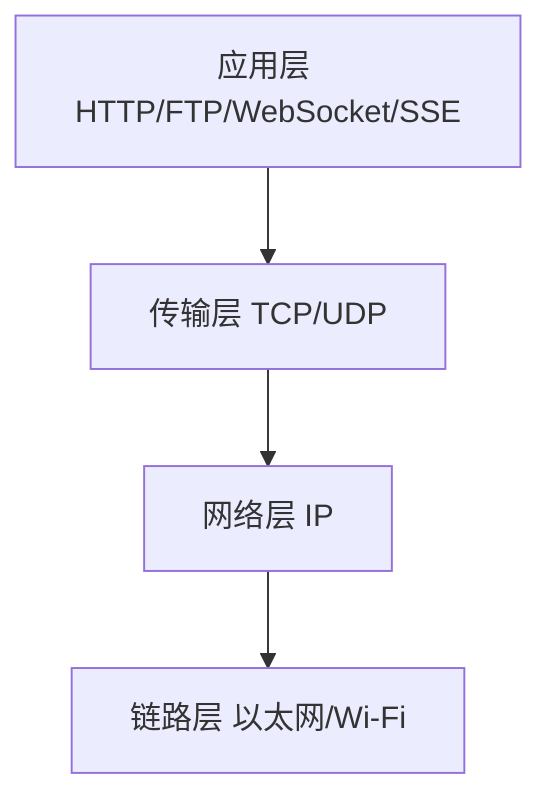
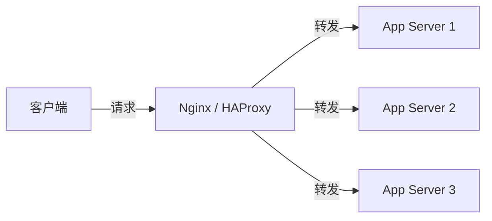
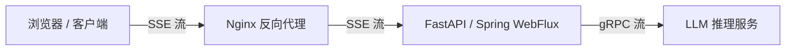

# 计算机网络与HTTP

---

## 1. 它是什么

计算机网络是多个独立计算机通过通信链路互联起来，按照一定的协议进行数据交换的系统。HTTP（HyperText Transfer Protocol）是构建在 TCP/IP 协议栈之上、用于 Web 通信的应用层协议。



大纲中的核心组件：
- **TCP/IP**：互联网的基础协议簇，定义了数据如何打包、寻址、传输和路由。
- **HTTP**：Web 世界的通用语言，客户端和服务端之间的请求-响应协议。
- **WebSocket**：基于 TCP 的全双工通信协议，适合实时推送。
- **SSE（Server-Sent Events）**：服务端单向推送，通过 HTTP 长连接持续向客户端发送事件流。
- **RESTful API / RPC**：两种主流的服务间通信架构风格。
- **反向代理 / Nginx**：网关层组件，负责负载均衡、SSL 终结、缓存等。

## 2. 为什么需要它

| 需求 | 说明 |
|------|------|
| **进程间通信** | 不同机器上的进程需要交换数据，计算机网络提供了跨越物理边界的通信能力 |
| **资源共享** | 浏览器需要从远端服务器获取 HTML、CSS、JS、图片等资源 |
| **服务解耦** | 微服务架构下，各个服务通过 HTTP/RPC 进行同步调用，通过消息队列进行异步通信 |
| **实时性需求** | Agent 应用需要实时流式输出推理结果（SSE），或需要双向实时交互（WebSocket） |
| **安全传输** | HTTPS/TLS 确保数据在传输过程中不被窃听、篡改 |

对于 **Agent 应用** 而言，SSE、WebSocket 和流式响应尤为重要：
- 大模型推理是逐 token 生成的，必须通过流式 HTTP 响应（SSE / chunked transfer）将中间结果实时推送给用户，否则用户将等待数十秒才能看到完整输出。
- 多 Agent 协作场景下需要双向通信通道（WebSocket），让服务端主动推送状态变更。
- 反向代理层（Nginx）负责 SSE 连接的缓冲策略配置，不当的缓冲会导致流式响应被截断或延迟。

## 3. 它解决什么问题

| 问题 | 解决方案 |
|------|----------|
| 数据如何可靠传输 | TCP 的三次握手、确认重传、流量控制、拥塞控制 |
| 如何区分不同应用 | 端口号（HTTP 80，HTTPS 443） |
| 如何定位目标主机 | DNS 将域名解析为 IP 地址 |
| 如何标识资源位置 | URL/URI |
| 如何保证传输安全 | TLS 握手、证书验证、对称加密 |
| 如何实现实时通信 | WebSocket（全双工）和 SSE（服务端推送） |
| 如何水平扩展服务 | 反向代理 Nginx 做负载均衡 |
| 服务间如何通信 | RESTful API 或 RPC 框架 |

## 4. 核心原理

### 4.1 TCP/IP 协议栈

```
应用层    HTTP / WebSocket / SSE / DNS / RPC
传输层    TCP（可靠、有序） / UDP（快速、无连接）
网络层    IP（寻址、路由）
链路层    以太网、Wi-Fi（物理传输）
```

**数据封装过程**：应用数据 → 传输层加 TCP/UDP 头部 → 网络层加 IP 头部 → 链路层加帧头部。

### 4.2 TCP 三次握手

建立连接时双方交换三个报文，目的是**确认双方的收发能力正常，并同步初始序列号**。

```
客户端                         服务端
  |                              |
  |---- SYN (seq=x) ------------>| 第一次握手：客户端发送 SYN，
  |                              |            进入 SYN_SENT 状态
  |<--- SYN+ACK (seq=y, ack=x+1)-| 第二次握手：服务端回复 SYN+ACK，
  |                              |            进入 SYN_RCVD 状态
  |---- ACK (seq=x+1, ack=y+1)->| 第三次握手：客户端发送 ACK，
  |                              |            双方进入 ESTABLISHED
```

**为什么是三次而不是两次？** 防止已失效的连接请求突然又传到服务端，导致错误建立连接。两次握手无法确认客户端的接收能力，也无法防止历史 SYN 报文造成资源浪费。

### 4.3 TCP 四次挥手

终止连接需要四次交互，因为 TCP 是**全双工**的，每一方都需要独立关闭自己的发送通道。

```
客户端                         服务端
  |                              |
  |---- FIN (seq=u) ----------->| 第一次挥手：客户端发送 FIN，
  |                              |            进入 FIN_WAIT_1
  |<--- ACK (ack=u+1) ---------| 第二次挥手：服务端回复 ACK，
  |                              |            进入 CLOSE_WAIT（客户端 FIN_WAIT_2）
  |                              | 服务端可能还有数据要发送...
  |<--- FIN (seq=v) ------------| 第三次挥手：服务端数据发完，发送 FIN，
  |                              |            进入 LAST_ACK
  |---- ACK (ack=v+1) --------->| 第四次挥手：客户端回复 ACK，
  |                              |            进入 TIME_WAIT（2MSL 后关闭）
```

**为什么需要 TIME_WAIT？** 确保最后一个 ACK 能到达服务端，以及让网络中残留的报文自然消亡，避免影响后续连接。

### 4.4 TCP 与 UDP 区别

| 特性 | TCP | UDP |
|------|-----|-----|
| 连接性 | 面向连接 | 无连接 |
| 可靠性 | 可靠传输、确认重传 | 不可靠，尽最大努力交付 |
| 有序性 | 保证数据顺序 | 不保证 |
| 流量控制 | 滑动窗口 | 无 |
| 拥塞控制 | 慢启动、拥塞避免、快重传、快恢复 | 无 |
| 首部开销 | 20-60 字节 | 8 字节 |
| 传输方式 | 字节流 | 报文 |
| 适用场景 | HTTP、WebSocket、FTP、SSH | DNS、DHCP、视频直播、VoIP |

### 4.5 HTTP 请求和响应结构

**请求报文**：
```
GET /api/users HTTP/1.1
Host: example.com
User-Agent: Mozilla/5.0
Accept: application/json

```

**响应报文**：
```
HTTP/1.1 200 OK
Content-Type: application/json
Content-Length: 45
Date: Mon, 27 Jul 2026 12:00:00 GMT

{"id": 1, "name": "Alice"}
```

通用格式：**起始行 + 头部（Headers）+ 空行 + 消息体（Body）**。

### 4.6 HTTP 方法

| 方法 | 含义 | 幂等 | 安全 | 请求体 |
|------|------|------|------|--------|
| GET | 获取资源 | ✅ | ✅ | 无 |
| POST | 创建资源 | ❌ | ❌ | 有 |
| PUT | 全量替换资源 | ✅ | ❌ | 有 |
| PATCH | 部分更新资源 | ❌（约定幂等） | ❌ | 有 |
| DELETE | 删除资源 | ✅ | ❌ | 无 |

- **幂等**：多次执行结果相同。
- **安全**：不会修改服务端状态。

### 4.7 HTTP 状态码

| 分类 | 范围 | 含义 | 常见状态码 |
|------|------|------|-----------|
| 1xx | 100-199 | 信息性 | 100 Continue、101 Switching Protocols（WebSocket 升级） |
| 2xx | 200-299 | 成功 | 200 OK、201 Created、204 No Content |
| 3xx | 300-399 | 重定向 | 301 Moved Permanently、302 Found、304 Not Modified |
| 4xx | 400-499 | 客户端错误 | 400 Bad Request、401 Unauthorized、403 Forbidden、404 Not Found、429 Too Many Requests |
| 5xx | 500-599 | 服务端错误 | 500 Internal Server Error、502 Bad Gateway、503 Service Unavailable、504 Gateway Timeout |

### 4.8 Header、Cookie、Session

**常见 Header**：

| Header | 说明 |
|--------|------|
| `Content-Type` | 请求/响应体的 MIME 类型 |
| `Content-Length` | 请求/响应体的大小（字节） |
| `Authorization` | 认证凭证（Bearer token / Basic auth） |
| `Cookie` | 客户端发送给服务端的 cookie |
| `Set-Cookie` | 服务端要求客户端设置的 cookie |
| `Cache-Control` | 缓存策略（no-cache, max-age 等） |
| `Accept` | 客户端可接受的响应类型 |
| `User-Agent` | 客户端标识 |
| `Host` | 请求的主机名和端口 |
| `Origin` / `Access-Control-Allow-Origin` | CORS 跨域控制 |
| `Transfer-Encoding: chunked` | 分块传输（用于流式响应） |

**Cookie 与 Session**：
- **Cookie**：存储在客户端浏览器的小型数据片段，每次请求自动附带。
- **Session**：存储在服务端的用户会话数据，通过 Session ID（通常存于 Cookie）关联。
- 区别：Cookie 存储在客户端，有大小限制（4KB）、数量限制（每个域名约 50 个）；Session 存储在服务端，更安全，但需要额外的存储管理（内存、Redis）。

### 4.9 HTTPS 和 TLS

HTTPS = HTTP + TLS（传输层安全协议）。

**TLS 握手流程（简化的 1.3 版本）**：
1. 客户端发送 ClientHello（支持的 TLS 版本、密码套件、随机数）。
2. 服务端回复 ServerHello（选定版本、密码套件、随机数）+ 证书 + 公钥。
3. 客户端验证证书链，生成预主密钥，用服务端公钥加密后发送。
4. 双方各自计算出对称会话密钥，后续通信使用对称加密。

**为什么需要 HTTPS？**
- **保密性**：防止中间人窃听。
- **完整性**：防止数据被篡改。
- **身份认证**：确认服务端的真实身份（通过 CA 证书链）。

### 4.10 DNS 解析

```
用户输入 example.com
    ↓
浏览器缓存 → 操作系统缓存 → 本地 hosts 文件 → 递归 DNS 服务器
    ↓
根 DNS 服务器 → TLD DNS 服务器（.com）→ 权威 DNS 服务器
    ↓
返回 A/AAAA 记录（IP 地址）
```

**DNS 记录类型**：A（IPv4）、AAAA（IPv6）、CNAME（别名）、MX（邮件交换）、TXT（文本）。

### 4.11 长连接与短连接

| 类型 | 行为 | 优点 | 缺点 |
|------|------|------|------|
| 短连接 | 每次请求都新建 TCP 连接，完成后关闭 | 简单、无资源占用 | 频繁握手，延迟高 |
| 长连接（HTTP Keep-Alive） | 复用 TCP 连接处理多个请求 | 减少握手开销，降低延迟 | 需管理空闲连接，占用内存 |

HTTP/1.1 默认使用长连接（`Connection: keep-alive`），HTTP/2 更进一步实现多路复用。

### 4.12 HTTP/1.1 vs HTTP/2 vs HTTP/3

| 特性 | HTTP/1.1 | HTTP/2 | HTTP/3 |
|------|----------|--------|--------|
| 传输层 | TCP | TCP（二进制分帧 + 多路复用） | QUIC（基于 UDP） |
| 队头阻塞 | 有（一个请求阻塞，后续排队） | 有（TCP 层面的队头阻塞） | **无**（QUIC 独立流） |
| 多路复用 | ❌ | ✅（一个 TCP 连接并发多个流） | ✅ |
| 头部压缩 | ❌ | ✅（HPACK） | ✅（QPACK） |
| 服务器推送 | ❌ | ✅ | ✅ |
| 连接建立 | TCP 1.5 RTT | TCP 1.5 RTT | 0-RTT / 1-RTT |
| 主流支持 | 所有 | 大部分浏览器 | 逐渐普及 |

### 4.13 RESTful API

REST（Representational State Transfer）是一种架构风格，核心原则：
- **资源导向**：每个 URL 代表一个资源
- **无状态**：每个请求包含所有必要信息，服务端不保留客户端状态
- **统一接口**：使用标准 HTTP 方法操作资源

```
GET    /api/users          → 获取用户列表
POST   /api/users          → 创建用户
GET    /api/users/{id}     → 获取单个用户
PUT    /api/users/{id}     → 全量更新用户
PATCH  /api/users/{id}     → 部分更新用户
DELETE /api/users/{id}     → 删除用户
```

### 4.14 RPC（Remote Procedure Call）

RPC 使调用远程服务像调用本地函数一样透明。

常见 RPC 框架对比：

| 框架 | 协议 | 序列化 | 特点 |
|------|------|--------|------|
| gRPC | HTTP/2 | Protocol Buffers | 高性能、强类型、流式支持 |
| Thrift | TCP/HTTP | Thrift 二进制 | 跨语言支持好 |
| Dubbo | TCP | Hessian / JSON | Java 生态广泛使用 |
| Spring Cloud OpenFeign | HTTP | JSON | 与 Spring Boot 深度集成 |

**REST vs RPC**：
- REST：面向资源，URL 表示名词，动词由 HTTP 方法表达。
- RPC：面向操作，方法名直接体现在请求中（如 `POST /getUserById`），更接近函数调用语义。
- 选择建议：对外 API 倾向 REST，内部微服务通信倾向 gRPC。

### 4.15 WebSocket

WebSocket 在 TCP 之上提供**全双工**通信通道。

**连接建立**：通过 HTTP 升级（101 Switching Protocols）：
```
客户端 → 服务端：
GET /chat HTTP/1.1
Upgrade: websocket
Connection: Upgrade
Sec-WebSocket-Key: dGhlIHNhbXBsZSBub25jZQ==

服务端 → 客户端：
HTTP/1.1 101 Switching Protocols
Upgrade: websocket
Connection: Upgrade
Sec-WebSocket-Accept: s3pPLMBiTxaQ9kYGzzhZRbK+xOo=
```

**特点**：
- 建立后不再有 HTTP 头部开销
- 服务端可主动推送消息
- 支持文本和二进制帧
- 适用于聊天、实时协作、游戏、金融行情

### 4.16 SSE（Server-Sent Events）

SSE 是服务端通过 HTTP 连接持续向客户端推送事件流的单向技术。

**协议格式**（基于 `text/event-stream`）：
```
HTTP/1.1 200 OK
Content-Type: text/event-stream
Cache-Control: no-cache
Connection: keep-alive

data: {"token": "Hello"}

data: {"token": " world"}

data: [DONE]
```

**与 WebSocket 对比**：

| 特性 | SSE | WebSocket |
|------|-----|-----------|
| 通信方向 | 服务端 → 客户端（单向） | 全双工 |
| 协议 | 原生 HTTP | 独立协议（基于 HTTP 升级） |
| 自动重连 | 浏览器内置支持（`EventSource`） | 需自行实现 |
| 二进制数据 | ❌（仅文本） | ✅ |
| 浏览器兼容 | 主流浏览器支持 | 主流浏览器支持 |
| 实现复杂度 | 极低 | 中等 |
| 适用场景 | 通知推送、LLM 流式输出、日志流 | 聊天、游戏、实时协作 |

**对 Agent 应用的极端重要性**：当前大模型 API（OpenAI、Claude 等）的流式输出均基于 SSE，客户端通过读取 `text/event-stream` 中的 `data` 行来逐 token 获取推理结果。

### 4.17 反向代理

反向代理是位于客户端和后端服务器之间的中间层，代表后端接收请求。



**功能**：
- 负载均衡（round-robin、least_conn、ip_hash）
- SSL/TLS 终结
- 缓存静态资源
- 请求过滤和限流
- 统一入口和域名绑定
- WebSocket 和 SSE 的代理支持

### 4.18 Nginx 核心配置

```nginx
# 负载均衡
upstream backend {
    least_conn;
    server 10.0.0.1:8080;
    server 10.0.0.2:8080;
    server 10.0.0.3:8080;
}

# HTTP 代理
server {
    listen 80;
    server_name api.example.com;

    location / {
        proxy_pass http://backend;
        proxy_set_header Host $host;
        proxy_set_header X-Real-IP $remote_addr;
        proxy_set_header X-Forwarded-For $proxy_add_x_forwarded_for;
    }
}

# WebSocket 代理（需要额外配置）
server {
    listen 80;
    location /ws/ {
        proxy_pass http://backend;
        proxy_http_version 1.1;
        proxy_set_header Upgrade $http_upgrade;
        proxy_set_header Connection "upgrade";
        proxy_read_timeout 86400s;
    }
}

# SSE 流式代理（关键：关闭缓冲）
server {
    listen 80;
    location /sse/ {
        proxy_pass http://backend;
        proxy_buffering off;         # 必须关闭，否则 SSE 数据被缓冲
        proxy_cache off;
        chunked_transfer_encoding on;
        proxy_read_timeout 86400s;
    }
}
```

## 5. 基本使用方法

### 5.1 发送 HTTP 请求（Python）

```python
import httpx  # 推荐 httpx，支持异步和流式

# GET 请求
resp = httpx.get("https://api.example.com/users/1")
print(resp.json())

# POST 请求
resp = httpx.post(
    "https://api.example.com/users",
    json={"name": "Alice", "email": "alice@example.com"},
    headers={"Authorization": "Bearer token123"},
)

# 流式请求（SSE / 大模型推理）
async with httpx.AsyncClient() as client:
    async with client.stream("POST", "https://api.llm.com/chat", json={"prompt": "Hello"}) as resp:
        async for line in resp.aiter_lines():
            if line.startswith("data:"):
                token = line[5:].strip()
                print(token, end="", flush=True)
```

### 5.2 使用 WebSocket（Python）

```python
import asyncio
import websockets

async def chat():
    async with websockets.connect("wss://chat.example.com/ws") as ws:
        await ws.send("Hello")
        response = await ws.recv()
        print(f"Received: {response}")

asyncio.run(chat())
```

### 5.3 使用 SSE（JavaScript / 浏览器端）

```javascript
const eventSource = new EventSource("https://api.example.com/sse/events");

eventSource.onmessage = (event) => {
    const data = JSON.parse(event.data);
    console.log("Received:", data);
};

eventSource.onerror = (err) => {
    console.error("SSE Error:", err);
    // 浏览器会自动尝试重连
};

// 自定义事件类型
eventSource.addEventListener("heartbeat", (event) => {
    console.log("Heartbeat:", event.data);
});
```

### 5.4 使用 curl 测试网络

```bash
# 基础请求
curl -i https://api.example.com/users

# 查看请求/响应头
curl -v https://api.example.com/users

# POST JSON
curl -X POST https://api.example.com/users \
  -H "Content-Type: application/json" \
  -d '{"name":"Alice"}'

# 流式 SSE 请求
curl -N https://api.llm.com/chat/stream

# WebSocket 测试（需要 wscat）
wscat -c wss://echo.example.com
```

## 6. 工程中的典型实现

### 6.1 Agent 应用的 SSE 流式输出（Python FastAPI）

```python
from fastapi import FastAPI, Request
from fastapi.responses import StreamingResponse
import asyncio
import json

app = FastAPI()

async def llm_stream(prompt: str):
    # 模拟大模型逐 token 生成
    words = ["Hello", " world", "!", " How", " can", " I", " help", "?"]
    for word in words:
        yield f"data: {json.dumps({'token': word})}\n\n"
        await asyncio.sleep(0.1)
    yield "data: [DONE]\n\n"

@app.post("/v1/chat/stream")
async def chat_stream(request: Request):
    body = await request.json()
    prompt = body.get("prompt", "")
    return StreamingResponse(
        llm_stream(prompt),
        media_type="text/event-stream",
        headers={
            "Cache-Control": "no-cache",
            "Connection": "keep-alive",
            "X-Accel-Buffering": "no",  # 告知 Nginx 不要缓冲
        },
    )
```

### 6.2 WebSocket 实时通信（Python FastAPI + WebSockets）

```python
from fastapi import FastAPI, WebSocket, WebSocketDisconnect

app = FastAPI()

class ConnectionManager:
    def __init__(self):
        self.active_connections: list[WebSocket] = []

    async def connect(self, ws: WebSocket):
        await ws.accept()
        self.active_connections.append(ws)

    def disconnect(self, ws: WebSocket):
        self.active_connections.remove(ws)

    async def broadcast(self, message: str):
        for connection in self.active_connections:
            await connection.send_text(message)

manager = ConnectionManager()

@app.websocket("/ws/{client_id}")
async def websocket_endpoint(ws: WebSocket, client_id: str):
    await manager.connect(ws)
    try:
        while True:
            data = await ws.receive_text()
            await manager.broadcast(f"{client_id}: {data}")
    except WebSocketDisconnect:
        manager.disconnect(ws)
```

### 6.3 gRPC 服务间通信

```protobuf
// proto/chat.proto
service ChatService {
  rpc Chat (ChatRequest) returns (stream ChatResponse);  // 服务端流式
}

message ChatRequest {
  string prompt = 1;
}

message ChatResponse {
  string token = 1;
}
```

### 6.4 Nginx 反向代理配置（完整示例）

```nginx
upstream app_servers {
    least_conn;
    server 127.0.0.1:8080 weight=5;
    server 127.0.0.1:8081 weight=3;
    keepalive 32;  # 与后端保持长连接
}

server {
    listen 443 ssl http2;
    server_name api.example.com;

    ssl_certificate     /etc/ssl/certs/example.crt;
    ssl_certificate_key /etc/ssl/private/example.key;

    # 通用 API 代理
    location /api/ {
        proxy_pass http://app_servers;
        proxy_http_version 1.1;
        proxy_set_header Host $host;
        proxy_set_header X-Real-IP $remote_addr;
        proxy_set_header X-Forwarded-For $proxy_add_x_forwarded_for;
        proxy_set_header X-Forwarded-Proto $scheme;
    }

    # WebSocket 代理
    location /ws/ {
        proxy_pass http://app_servers;
        proxy_http_version 1.1;
        proxy_set_header Upgrade $http_upgrade;
        proxy_set_header Connection "upgrade";
        proxy_read_timeout 86400s;
    }

    # SSE 流式代理（关闭缓冲）
    location /sse/ {
        proxy_pass http://app_servers;
        proxy_http_version 1.1;
        proxy_buffering off;
        proxy_cache off;
        chunked_transfer_encoding on;
        proxy_read_timeout 86400s;
        proxy_set_header Connection "";
    }
}
```

## 7. 常见失败场景

### 7.1 TCP 层面

| 场景 | 现象 | 原因 | 解决方案 |
|------|------|------|----------|
| 端口未监听 | `Connection refused` | 服务未启动或端口错误 | 检查服务，确认端口 |
| 防火墙拦截 | `Connection timed out` | 安全组/防火墙规则 | 检查 iptables、云安全组 |
| TIME_WAIT 过多 | 端口耗尽 | 短连接大量频繁建立 | 启用连接池/长连接 |
| 半连接队列满 | 丢包、连接缓慢 | SYN 洪水攻击或高并发 | 增大 `tcp_max_syn_backlog`、启用 SYN Cookie |
| TCP 重传率过高 | 响应慢、超时 | 网络丢包或带宽不足 | 检查网络质量、考虑多活部署 |

### 7.2 HTTP 层面

| 场景 | 状态码 | 原因 | 解决方案 |
|------|--------|------|----------|
| 请求体过大 | 413 Payload Too Large | Nginx/服务端限制 | 增大 `client_max_body_size` |
| URI 过长 | 414 URI Too Long | 查询参数过多 | 改用 POST 或缩短参数 |
| 跨域失败 | CORS 错误 | 未配置 `Access-Control-Allow-Origin` | 服务端添加跨域头 |
| 405 Method Not Allowed | HTTP 方法不支持 | 路由配置错误 | 检查路由或添加对应方法处理器 |

### 7.3 SSE 和流式响应

| 场景 | 现象 | 原因 | 解决方案 |
|------|------|------|----------|
| 流式输出被缓冲 | 客户端收不到分片数据 | Nginx 或代理开启了缓冲 | 设置 `proxy_buffering off` |
| 连接超时断开 | 流式输出中途中断 | `proxy_read_timeout` 过短 | 设置为较大值（如 86400s） |
| 数据格式错误 | 客户端解析失败 | SSE 格式不符合 `text/event-stream` | 确保每行前缀正确（`data:`、空行分隔） |
| 浏览器 SSE 限制 | 单个域名最多 6 个 SSE 连接 | 浏览器限制 | 使用 WebSocket 或切换 HTTP/2 |

### 7.4 WebSocket

| 场景 | 现象 | 原因 | 解决方案 |
|------|------|------|----------|
| 连接无法建立 | 101 未返回 | Nginx 未配置 Upgrade header | 添加 `proxy_set_header Upgrade $http_upgrade` |
| 连接频繁断开 | WebSocket 异常关闭 | 负载均衡超时或无心跳 | 实现 WebSocket 心跳（ping/pong） |
| 跨域 WS 失败 | WebSocket 握手被拒绝 | 服务端未校验 Origin | 添加 `Sec-WebSocket-Origin` 校验 |

### 7.5 DNS

| 场景 | 现象 | 原因 | 解决方案 |
|------|------|------|----------|
| DNS 缓存未刷新 | 域名指向旧 IP | TTL 未过期或 DNS 缓存 | 手动刷新 DNS 缓存或调低 TTL |
| DNS 劫持 | 域名指向恶意 IP | 公共 DNS 被污染 | 使用 DoH/DoT（如 1.1.1.1, 8.8.8.8） |
| DNS 解析慢 | 首次请求延迟高 | DNS 服务器响应慢 | 配置本地 DNS 缓存（如 `dnsmasq`、`nscd`） |

## 8. 如何调试

### 8.1 网络层

```bash
# 测试连通性
ping -c 5 example.com

# 路由追踪
tracert example.com          # Windows
traceroute example.com       # Linux

# DNS 解析
nslookup example.com
dig example.com

# 查看 TCP 连接状态
netstat -an | findstr :80    # Windows
ss -tlnp                     # Linux
```

### 8.2 HTTP 层

```bash
# 查看完整请求/响应（-v）
curl -v https://api.example.com

# 查看响应头（-I）
curl -I https://api.example.com

# 流式 SSE 调试
curl -N https://api.llm.com/stream

# 指定 HTTP 版本
curl --http2 https://api.example.com
```

### 8.3 浏览器开发者工具

- **Network 面板**：查看请求耗时、请求/响应头、响应体
- **Timing 标签**：分解 DNS Lookup、TCP Connect、TLS Handshake、TTFB、Content Download
- **WebSocket 面板**：查看 WS 帧的内容和发送方向
- **EventStream 面板**（Chrome）：查看 SSE 事件流

### 8.4 高级工具

| 工具 | 用途 |
|------|------|
| **Wireshark / tcpdump** | 抓包分析 TCP/IP 层详细交互 |
| **ngrok** | 将本地服务暴露到公网，便于回调调试 |
| **mitmproxy** | 本地 HTTPS 中间人代理，查看加密流量 |
| **Postman / Bruno** | 可视化 API 调试工具 |
| **curl + jq** | 命令行脚本化 API 测试 |

### 8.5 流式响应调试

```bash
# 使用 curl 调试 SSE，逐行输出
curl -N -s https://api.llm.com/v1/chat/stream \
  -H "Content-Type: application/json" \
  -d '{"prompt": "Hello"}' | while IFS= read -r line; do
    echo "[$(date '+%H:%M:%S.%3N')] $line"
  done

# 用 Python 模拟客户端调试
python -c "
import httpx
with httpx.stream('POST', 'https://api.llm.com/chat', json={'prompt': 'Hi'}) as r:
    for line in r.iter_lines():
        print(repr(line))
"
```

## 9. 如何测试

### 9.1 单元测试（HTTP 客户端 mock）

```python
# Python: 使用 respx 或 httpx 的 mock 功能
import httpx
import respx
from httpx import Response

@respx.mock
def test_fetch_user():
    respx.get("https://api.example.com/users/1").mock(
        return_value=Response(200, json={"id": 1, "name": "Alice"})
    )

    resp = httpx.get("https://api.example.com/users/1")
    assert resp.status_code == 200
    assert resp.json()["name"] == "Alice"
```

### 9.2 集成测试

```python
# 使用 TestClient（FastAPI）
from fastapi.testclient import TestClient
from main import app

client = TestClient(app)

def test_stream_sse():
    with client.stream("POST", "/v1/chat/stream", json={"prompt": "Hi"}) as resp:
        assert resp.status_code == 200
        assert resp.headers["content-type"] == "text/event-stream"
        lines = []
        for line in resp.iter_lines():
            if line:
                lines.append(line)
        assert len(lines) > 0
```

### 9.3 负载测试

```bash
# 使用 hey（基于 Go 的压测工具）
hey -n 10000 -c 100 https://api.example.com/users

# 使用 wrk
wrk -t12 -c400 -d30s https://api.example.com/users

# 使用 k6（JavaScript 脚本）
k6 run --vus 100 --duration 30s script.js
```

### 9.4 WebSocket 测试

```python
import pytest
import asyncio
import websockets

@pytest.mark.asyncio
async def test_websocket_echo():
    async with websockets.connect("wss://echo.example.com") as ws:
        await ws.send("Hello")
        response = await asyncio.wait_for(ws.recv(), timeout=5)
        assert response == "Hello"
```

### 9.5 SSE 测试

```bash
# 使用 sseclient 库
pip install sseclient-py

python -c "
import sseclient
import httpx

with httpx.stream('GET', 'https://api.example.com/sse/events') as resp:
    client = sseclient.SSEClient(resp)
    for event in client.events():
        print(f'Event: {event.event}, Data: {event.data}')
"
```

## 10. 如何监控

### 10.1 核心指标

| 指标 | 说明 | 告警阈值 |
|------|------|----------|
| 请求总量（RPS） | 每秒请求数 | 根据容量规划设定 |
| 错误率（5xx / 4xx） | HTTP 错误占比 | 5xx > 1% 告警，4xx > 5% 关注 |
| 延迟（P50 / P95 / P99） | 请求响应时间 | P99 > 1s 告警 |
| TTFB（Time To First Byte） | 首字节到达时间 | > 500ms 关注 |
| TCP 连接数 | 当前 ESTABLISHED 连接数 | 接近系统上限告警 |
| TIME_WAIT 数量 | 大量 TIME_WAIT 表示连接未复用 | > 10000 关注 |
| DNS 解析耗时 | 域名解析延迟 | > 200ms 关注 |
| TLS 握手耗时 | 密钥协商延迟 | > 500ms 关注 |

### 10.2 SSE / 流式响应专项指标

| 指标 | 说明 |
|------|------|
| TTFP（Time To First Token） | 从请求发出到收到第一个 token 的时间 |
| Token 输出速率（tokens/s） | 每秒生成的 token 数量 |
| 流中断次数 | 流式连接非正常关闭的次数 |
| 流平均时长 | SSE 连接的平均持续时间 |
| 单流 token 总数 | 每次流式响应输出的总 token 数 |

### 10.3 监控工具栈

| 层级 | 工具 |
|------|------|
| 基础设施 | Prometheus + Grafana（指标收集与可视化） |
| 日志 | ELK（Elasticsearch + Logstash + Kibana）或 Loki |
| 链路追踪 | OpenTelemetry + Jaeger / Zipkin |
| 告警 | Alertmanager + 钉钉/飞书/邮件通知 |
| 拨测 | 外部探针定期模拟用户请求（如 Checkly、UptimeRobot） |
| 实时流量 | Nginx 日志 → Filebeat → Elasticsearch → Kibana |

### 10.4 Nginx 监控

```nginx
# Stub Status 模块
location /nginx_status {
    stub_status on;
    allow 127.0.0.1;
    deny all;
}
```

输出示例：
```
Active connections: 291
server accepts handled requests
 16630948 16630948 31070465
Reading: 6 Writing: 179 Waiting: 106
```

## 11. 常见面试问题

### TCP / IP

1. **为什么 TCP 连接是三次握手而不是两次？**
   > 防止已失效的连接请求到达服务端。如果客户端第一个 SYN 在网络中滞留，客户端超时重发后建立连接并关闭，此时滞留的 SYN 到达服务端，两次握手会直接建立连接浪费资源；三次握手中服务端回复 SYN+ACK 后需等待客户端的 ACK，若客户端已关闭则回复 RST 断开。

2. **TIME_WAIT 为什么是 2MSL？**
   > MSL（Maximum Segment Lifetime）是报文最大生存时间，2MSL 可确保最后一个 ACK 能到达服务端，并让本连接产生的所有报文从网络中消失。

3. **TCP 拥塞控制的四个阶段？**
   > 慢启动（cwnd 从 1 开始指数增长）→ 拥塞避免（达到 ssthresh 后线性增长）→ 快重传（收到 3 个冗余 ACK 立即重传）→ 快恢复（降低 cwnd 但不再回到 1）。

### HTTP

4. **GET 和 POST 有什么区别？**
   > GET 幂等、安全、参数在 URL 中、有长度限制；POST 不幂等、参数在 body 中、无长度限制。但本质区别是语义不同：GET 用于获取资源，POST 用于创建资源。

5. **HTTP 无状态如何保持会话？**
   > 通过 Cookie + Session 或 JWT（JSON Web Token）。服务端生成 Session ID 写入 Set-Cookie，客户端后续请求自动带上 Cookie，服务端根据 Session ID 查找会话数据。JWT 则直接在 Token 中编码用户信息。

6. **HTTPS 加密过程？**
   > 非对称加密交换对称密钥：服务端下发 CA 签名证书，客户端验证证书后生成随机密钥并用公钥加密发送，之后双方用对称密钥加密通信。

7. **HTTP/2 多路复用解决了什么问题？**
   > 解决了 HTTP/1.1 的队头阻塞问题。多个请求可以同时在同一个 TCP 连接上交错传输，不需要等待前一个请求完成。

8. **HTTP/3 为什么改用 QUIC？**
   > 彻底解决 TCP 层面的队头阻塞，减少连接建立延迟（0-RTT），更好支持网络切换（连接迁移）。

### REST / RPC

9. **RESTful API 设计原则？**
   > 资源 URL 使用名词复数、HTTP 方法表示操作、无状态、分页/过滤/排序通过查询参数、版本化（URL 路径或 Header）。

10. **REST 与 RPC 的区别和选型？**
    > REST 面向资源，适合对外 API；RPC 面向操作，适合内部服务间调用。RPC 通常性能更好（二进制序列化），但耦合更高。

### WebSocket / SSE

11. **WebSocket 和 SSE 的适用场景？**
    > WebSocket：需要双向实时通信（聊天、协作编辑、游戏）。SSE：只需要服务端推送（通知、大模型流式输出、日志流）。SSE 更轻量，浏览器原生支持自动重连。

12. **WebSocket 如何实现心跳保活？**
    > 服务端定时发送 ping 帧，客户端回复 pong 帧。超过一定时间未收到 pong 则断开并尝试重连。

13. **SSE 如何保证数据不丢失？**
    > 每个 event 有 `id` 字段，断连重连时客户端在 `Last-Event-ID` 中带上上次收到的 ID，服务端从该 ID 之后重新推送。

### 反向代理 / Nginx

14. **Nginx 的几种负载均衡策略？**
    > round-robin（默认轮询）、least_conn（最少连接）、ip_hash（IP 哈希保持会话）、weight（权重）。

15. **Nginx 代理 SSE 需要哪些配置？**
    > `proxy_buffering off`、`proxy_cache off`、`proxy_read_timeout` 设为较大值，并添加 `X-Accel-Buffering: no` 响应头。

## 12. 在我的项目中如何使用

### 12.1 Agent 应用的流式输出架构



**关键设计决策**：
1. **客户端统一使用 SSE**：浏览器原生 `EventSource` 支持自动重连，后端按标准 SSE 格式输出。
2. **Nginx 层关闭缓冲**：确保流式数据不被中间层缓存，实时到达客户端。
3. **后端流式处理**：使用响应式编程（Python `StreamingResponse` / Java `ServerSentEvent`），避免大模型推理阻塞工作线程。
4. **gRPC 流用于服务间通信**：Agent 编排服务与 LLM 推理服务之间使用 gRPC 双向流，保持低延迟。

### 12.2 技术选型参考

| 组件 | 推荐技术 | 理由 |
|------|----------|------|
| 对外 API | RESTful（JSON over HTTP/2） | 通用性好，客户端兼容 |
| 内部微服务 | gRPC（双向流） | 高性能，强类型，原生流式支持 |
| 实时推送 | SSE（服务端 → 客户端） | 轻量，兼容性好，浏览器自动重连 |
| 双向实时 | WebSocket | Agent 间实时协作、调试终端 |
| 网关层 | Nginx | 稳定，配置灵活，SSL/WS/SSE 代理支持好 |
| 安全 | HTTPS + TLS 1.3 + JWT | 加密传输 + 无状态认证 |
| DNS | CoreDNS 或 coredns | 服务发现与内部域名解析 |

### 12.3 配置清单

- [ ] Nginx 配置 `proxy_buffering off` 用于 SSE 路径
- [ ] Nginx 配置 WebSocket 的 Upgrade header
- [ ] 后端接口设置 `X-Accel-Buffering: no` 响应头
- [ ] 所有对外接口强制 HTTPS（HSTS + TLS 1.3）
- [ ] CORS 配置明确允许的 Origin，不滥用 `*`
- [ ] 客户端实现 SSE 重连逻辑（利用 `Last-Event-ID`）
- [ ] WebSocket 心跳间隔设为 30s
- [ ] 客户端设置合理的超时时间（读超时 60s+，流式场景更长）
- [ ] DNS 缓存配置（本地 `nscd` / `dnsmasq` / Java `JNDI DNS` TTL 配置）
- [ ] 连接池配置：HTTP 连接池最大连接数、空闲超时
