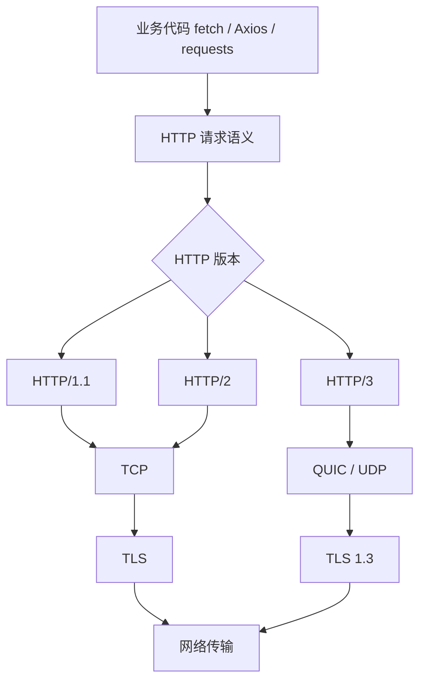
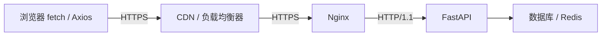

# HTTP、HTTPS与HTTP版本

> 本文是《计算机网络与HTTP》的 Web 传输专题，聚焦 TLS、HTTP/1.1、HTTP/2、HTTP/3 的关系、选型与排障。

---

## 1. 它是什么

HTTP（HyperText Transfer Protocol）是 Web 通信中使用的应用层协议，负责定义客户端与服务端之间如何组织请求和响应。

一个 HTTP 请求通常包含：

* 请求方法，如 GET、POST、PUT、DELETE
* 请求地址
* Header
* Cookie
* 请求体

一个 HTTP 响应通常包含：

* 状态码，如 200、404、500
* Header
* Cookie
* 响应体

HTTPS 并不是一种完全独立于 HTTP 的新协议，而是：

```text
HTTPS = HTTP + TLS
```

其中：

* **HTTP** 负责描述“传输什么数据”。
* **TLS** 负责保证“数据安全地传输”。
* **HTTP/1.1、HTTP/2、HTTP/3** 负责规定“HTTP 数据具体如何在网络中传输”。

因此，HTTP 版本和 HTTPS 并不是互斥关系，现实中可以存在以下组合：

```text
HTTPS + HTTP/1.1
HTTPS + HTTP/2
HTTPS + HTTP/3
```

整体关系如下：



可以将整个过程理解为：

```text
业务代码
    ↓
HTTP 请求与响应
    ↓
HTTP/1.1、HTTP/2 或 HTTP/3
    ↓
TCP 或 QUIC
    ↓
TLS 加密
    ↓
网络传输
```

---

## 2. 为什么需要它

早期 HTTP 采用明文传输，无法满足现代 Web 对安全性、并发性和网络性能的要求。

| 需求            | 说明                                |
| ------------- | --------------------------------- |
| **保护敏感数据**    | 防止密码、Cookie、Token、请求参数和响应内容被窃听    |
| **防止数据篡改**    | 确保请求和响应在网络中没有被中间人修改               |
| **确认服务器身份**   | 通过数字证书确认访问的服务器确实属于目标域名            |
| **减少连接开销**    | HTTP/1.1 使用长连接，避免每次请求都重新建立 TCP 连接 |
| **提高请求并发能力**  | HTTP/2、HTTP/3 可以在一个连接中同时传输多个请求    |
| **适应移动和弱网环境** | HTTP/3 减少丢包和网络切换对请求的影响            |
| **降低业务开发复杂度** | 浏览器、客户端库和代理服务器自动处理底层协议细节          |

对于现代 Web 应用，HTTPS 不应只用于登录或支付页面。

普通页面中同样可能包含：

* 用户 Cookie
* 身份认证 Token
* 用户个人信息
* 搜索关键词
* API 请求参数
* 订单和业务数据

因此，生产环境中的页面和接口通常都应使用 HTTPS。

---

## 3. 它解决什么问题

| 问题                   | 对应解决方案                  |
| -------------------- | ----------------------- |
| HTTP 数据可以被直接读取       | TLS 对 HTTP 内容进行加密       |
| 无法确认服务器真实身份          | CA 证书链和域名验证             |
| 数据可能被中途修改            | TLS 完整性校验               |
| HTTP/1.0 频繁建立连接      | HTTP/1.1 Keep-Alive     |
| HTTP/1.1 请求容易排队      | HTTP/2 多路复用             |
| HTTP/2 丢包影响多个请求流     | HTTP/3 使用独立 QUIC Stream |
| 开发者不知道应该选择哪个 HTTP 版本 | 客户端与服务端自动协商             |
| 后端业务代码不想处理 TLS 和连接细节 | CDN、Nginx、网关统一处理        |
| HTTP/3 在某些网络中不可用     | 自动回退到 HTTP/2 或 HTTP/1.1 |

---

## 4. 核心原理

### 4.1 HTTP 与 HTTPS 的关系

HTTP 定义的是请求和响应的结构。

例如，一个普通请求可能是：

```http
GET /api/users/1 HTTP/1.1
Host: api.example.com
Accept: application/json
Authorization: Bearer token123
```

服务端返回：

```http
HTTP/1.1 200 OK
Content-Type: application/json

{"id": 1, "name": "Alice"}
```

如果使用普通 HTTP，这些内容会以明文形式在网络中传输。

如果使用 HTTPS，HTTP 报文会先经过 TLS 加密：

```text
HTTP 请求
    ↓
TLS 加密
    ↓
TCP 或 QUIC
    ↓
网络传输
```

服务端收到数据后执行相反过程：

```text
网络数据
    ↓
TLS 解密
    ↓
还原 HTTP 请求
    ↓
交给应用程序处理
```

因此，HTTP 和 HTTPS 的核心区别不是请求方法或返回格式发生了变化，而是 HTTP 外层是否增加了 TLS 安全保护。

---

### 4.2 HTTPS 提供的三项核心能力

#### 1. 保密性

TLS 会加密 HTTP 请求和响应，使中间网络设备无法直接读取：

* URL 路径
* 查询参数
* Header
* Cookie
* Authorization Token
* 请求体
* 响应内容

例如，以下登录请求在 HTTPS 中不会以明文形式传输：

```json
{
  "username": "alice",
  "password": "123456"
}
```

#### 2. 完整性

TLS 会对传输数据进行完整性保护。

如果数据在传输过程中被修改，通信双方能够检测到异常，从而避免继续处理被篡改的数据。

#### 3. 身份认证

服务端向客户端提供数字证书。

浏览器会检查：

* 证书中的域名是否与当前访问域名一致
* 证书是否仍在有效期内
* 证书是否由可信 CA 签发
* 证书链是否完整
* 证书是否被撤销

只有验证通过后，浏览器才会信任当前服务器身份。

需要注意的是，HTTPS 并不会隐藏所有网络信息。

网络观察者仍可能看到：

* 目标 IP 地址
* 连接发生的时间
* 数据包数量
* 大致的数据传输量
* 连接持续时间

但通常无法直接看到具体的请求路径、Cookie、Token、请求体和响应内容。域名本身仍可能通过 DNS 查询或未启用 ECH 时的 TLS SNI 暴露；HTTPS 不等于完全匿名。

---

### 4.3 TLS 连接过程

简化后的 TLS 连接过程如下：

```text
客户端                              服务端
   |                                   |
   |---- ClientHello ----------------->|
   |     支持的 TLS 版本、加密算法       |
   |                                   |
   |<--- ServerHello + 数字证书 --------|
   |     选择 TLS 参数并证明服务器身份    |
   |                                   |
   | 客户端验证：                        |
   | 1. 证书域名是否匹配                 |
   | 2. 证书是否过期                     |
   | 3. 证书链是否可信                   |
   |                                   |
   |<====== 协商会话密钥 ===============>|
   |                                   |
   |<====== 加密 HTTP 通信 =============>|
```

TLS 中通常会同时使用非对称密码学和对称加密：

* **非对称密码学**主要用于身份认证和密钥协商。
* **对称加密**主要用于后续大量业务数据传输。

原因是非对称密码学适合解决身份和密钥交换问题，但计算成本较高；对称加密更适合持续、高效地传输大量数据。

---

### 4.4 HTTP、HTTPS 与 HTTP 版本不是同一个维度

HTTP 和 HTTPS主要描述是否使用 TLS：

```text
http://example.com
https://example.com
```

HTTP/1.1、HTTP/2、HTTP/3描述的是 HTTP 数据如何传输：

```text
HTTP/1.1：基于 TCP 的文本协议
HTTP/2：基于 TCP 的二进制多路复用协议
HTTP/3：基于 QUIC 的二进制多路复用协议
```

因此：

```text
HTTPS 不等于 HTTP/2
HTTP/2 也不等于 HTTPS
```

但在现代浏览器和公网环境中，HTTP/2 通常会与 HTTPS 一起使用，HTTP/3 则直接建立在 QUIC 和 TLS 1.3 之上。

---

### 4.5 HTTP/1.1、HTTP/2、HTTP/3 的区别

| 特性    | HTTP/1.1 | HTTP/2     | HTTP/3      |
| ----- | -------- | ---------- | ----------- |
| 底层传输  | TCP      | TCP        | QUIC，基于 UDP |
| 数据格式  | 文本报文     | 二进制帧       | 二进制帧        |
| 默认长连接 | ✅        | ✅          | ✅           |
| 多路复用  | ❌        | ✅          | ✅           |
| 头部压缩  | ❌        | HPACK      | QPACK       |
| TLS   | 可选       | 公网通常使用 TLS | 使用 TLS 1.3  |
| 队头阻塞  | HTTP 层明显 | 仍有 TCP 层阻塞 | 不同流相对独立     |
| 连接迁移  | ❌        | ❌          | ✅           |
| 兼容性   | 最好       | 非常成熟       | 逐渐普及        |

#### HTTP/1.1

HTTP/1.1 默认使用长连接，可以在一个 TCP 连接上连续发送多个请求。

```text
建立 TCP 连接
    ↓
发送请求 A
    ↓
接收响应 A
    ↓
发送请求 B
    ↓
接收响应 B
```

它解决了 HTTP/1.0 频繁建立连接的问题，但一个连接中的请求并发能力仍然有限。

#### HTTP/2

HTTP/2 将数据拆分为二进制帧，并在一个 TCP 连接中创建多个 Stream：

```text
一个 TCP 连接
├── Stream 1：HTML
├── Stream 3：CSS
├── Stream 5：JavaScript
└── Stream 7：图片
```

多个 Stream 的数据可以交错传输，从而提高并发效率。

但所有 Stream 仍然共享同一个 TCP 连接。如果 TCP 层发生丢包，多个 Stream 都可能受到影响。

#### HTTP/3

HTTP/3 使用 QUIC 代替 TCP。

```text
一个 QUIC 连接
├── Stream 1：HTML
├── Stream 3：CSS
├── Stream 5：JavaScript
└── Stream 7：图片
```

不同 QUIC Stream 相对独立。

如果图片对应的 Stream 发生丢包：

```text
图片 Stream：等待重传
HTML Stream：继续传输
CSS Stream：继续传输
API Stream：继续传输
```

这减少了 HTTP/2 中 TCP 丢包对所有请求流的共同影响。

---

### 4.6 当前网页通常使用什么协议

现代公网网站一般会同时支持多个 HTTP 版本：

```text
HTTPS
├── HTTP/3
├── HTTP/2
└── HTTP/1.1
```

客户端根据自身能力、服务器配置和网络环境自动选择。

通常可以理解为：

```text
尝试使用 HTTP/3
       ↓ 不可用
使用 HTTP/2
       ↓ 不可用
回退到 HTTP/1.1
```

HTTP/2 已经非常成熟，是现代网站最常见的传输协议之一。

HTTP/3 正在逐步普及，尤其常见于：

* CDN
* 大型网站
* 视频服务
* 移动端服务
* 跨地区访问
* 弱网环境

HTTP/1.1 则继续承担兼容和回退作用。

一个网页也不一定只使用一个 HTTP 版本。

例如：

```text
www.example.com               → HTTP/3
images.example-cdn.com        → HTTP/2
analytics.example.net         → HTTP/1.1
```

原因是每个域名和每条连接都会分别完成协议协商。

---

### 4.7 浏览器如何自动选择 HTTP 版本

当 JavaScript 执行：

```javascript
fetch("https://api.example.com/users");
```

浏览器内部大致会完成以下过程：

```text
1. 解析 URL
2. 判断使用 HTTP 还是 HTTPS
3. 查询 DNS
4. 检查浏览器缓存
5. 查找是否存在可复用连接
6. 尝试建立 TCP 或 QUIC 连接
7. 进行 TLS 握手
8. 验证服务器证书
9. 协商 HTTP 版本
10. 发送 HTTP 请求
11. 接收并解压响应
12. 执行 Cookie、缓存和 CORS 策略
13. 将结果交给 JavaScript
```

其中，开发者实际上已经通过 URL 选择了是否使用 TLS：

```text
http://  → 普通 HTTP
https:// → 使用 TLS 的 HTTPS
```

但是具体使用 HTTP/1.1、HTTP/2 还是 HTTP/3，通常由浏览器自动决定。

#### HTTP/2 协商

客户端和服务端可以在 TLS 连接建立过程中通过 ALPN 协商协议。

客户端可能声明：

```text
支持：
- h2
- http/1.1
```

服务端返回：

```text
选择：
- h2
```

其中：

```text
h2       = HTTP/2
http/1.1 = HTTP/1.1
```

#### HTTP/3 协商

服务器通常会通过 `Alt-Svc` 响应头告知客户端 HTTP/3 的可用地址，客户端再尝试建立 QUIC 连接。

如果 HTTP/3 连接成功，就使用 HTTP/3；如果失败，则继续使用已经可用的 HTTP/2 或 HTTP/1.1 连接。

这意味着协议升级通常不会阻塞正常访问。

---

## 5. 基本使用方法

### 5.1 浏览器发送 HTTPS 请求

```javascript
async function fetchUser(userId) {
    const response = await fetch(
        `https://api.example.com/users/${userId}`,
        {
            method: "GET",
            headers: {
                "Accept": "application/json",
                "Authorization": "Bearer token123"
            }
        }
    );

    if (!response.ok) {
        throw new Error(
            `HTTP request failed: ${response.status}`
        );
    }

    return response.json();
}
```

这里开发者只需要指定：

* URL
* 请求方法
* Header
* 请求体

不需要指定：

```text
HTTP/1.1
HTTP/2
HTTP/3
```

浏览器会自动进行协议协商。

---

### 5.2 Python requests

```python
import requests

try:
    response = requests.get(
        "https://api.example.com/users/1",
        headers={
            "Accept": "application/json",
            "Authorization": "Bearer token123",
        },
        timeout=10,
    )

    response.raise_for_status()
    print(response.json())

except requests.Timeout:
    print("请求超时")

except requests.RequestException as exc:
    print(f"请求失败：{exc}")
```

`requests` 比较适合：

* 普通 REST API
* HTTP/1.1 接口
* 同步请求
* 自动化脚本
* 简单服务调用

---

### 5.3 Python HTTPX

```python
import httpx

with httpx.Client(
    http2=True,
    timeout=httpx.Timeout(10.0),
) as client:
    response = client.get(
        "https://api.example.com/users/1"
    )

    print("HTTP version:", response.http_version)
    print("Status:", response.status_code)
    print("Body:", response.json())
```

HTTPX 比较适合：

* 同步和异步调用
* HTTP/2
* 连接池
* 流式响应
* FastAPI 项目
* 大模型接口调用

---

### 5.4 使用 curl 测试协议

```bash
# 自动协商协议
curl -v https://example.com

# 强制使用 HTTP/1.1
curl --http1.1 -v https://example.com

# 尝试使用 HTTP/2
curl --http2 -v https://example.com

# 尝试使用 HTTP/3
# 需要当前 curl 编译时支持 HTTP/3
curl --http3 -v https://example.com
```

---

## 6. 工程中的典型实现

### 6.1 前后端 Web 应用



浏览器代码：

```javascript
const response = await fetch("/api/products");
const products = await response.json();
```

FastAPI 代码：

```python
from fastapi import FastAPI

app = FastAPI()

@app.get("/api/products")
async def list_products():
    return {
        "items": [
            {
                "id": 1,
                "name": "Product A",
            },
            {
                "id": 2,
                "name": "Product B",
            },
        ]
    }
```

Nginx 或 CDN 负责：

* HTTPS 证书
* TLS 握手
* HTTP/2
* HTTP/3
* 反向代理
* 连接复用
* 静态资源缓存
* 负载均衡
* HTTP 到 HTTPS 的重定向

---

### 6.2 Nginx HTTPS 配置

下面的示例启用 HTTPS 和 HTTP/2。HTTP/3 的监听、TLS 和 UDP 443 配置会随 Nginx 版本及云厂商不同而变化，生产环境通常优先通过 CDN 或云负载均衡器启用。

```nginx
upstream backend {
    server 127.0.0.1:8000;
    keepalive 32;
}

server {
    listen 80;
    server_name api.example.com;

    # 强制将 HTTP 重定向到 HTTPS
    return 301 https://$host$request_uri;
}

server {
    listen 443 ssl http2;
    server_name api.example.com;

    ssl_certificate
        /etc/ssl/certs/example.crt;

    ssl_certificate_key
        /etc/ssl/private/example.key;

    location / {
        proxy_pass http://backend;
        proxy_http_version 1.1;

        proxy_set_header Host $host;
        proxy_set_header X-Real-IP $remote_addr;

        proxy_set_header X-Forwarded-For
            $proxy_add_x_forwarded_for;

        proxy_set_header X-Forwarded-Proto
            $scheme;
    }
}
```

在该架构中：

```text
浏览器 → Nginx：
HTTPS + HTTP/2

Nginx → FastAPI：
HTTP/1.1
```

FastAPI 不需要直接处理 TLS，也不需要知道浏览器原本使用的是 HTTP/2。

---

### 6.3 CDN 与 HTTP/3

启用 CDN 后，常见链路可能是：

```text
浏览器
   ↓ HTTPS + HTTP/3
CDN 边缘节点
   ↓ HTTPS + HTTP/2
源站 Nginx
   ↓ HTTP/1.1
应用服务
```

HTTP/3 一般由 CDN、云负载均衡器或边缘网关提供。

应用层仍然只需要处理：

```text
GET
POST
Header
Cookie
JSON
状态码
业务逻辑
```

---

### 6.4 后端调用第三方接口

普通同步接口调用：

```python
import requests

response = requests.get(
    "https://third-party.example.com/api/data",
    timeout=10,
)
```

需要异步、连接池或 HTTP/2：

```python
import httpx

async with httpx.AsyncClient(
    http2=True,
    timeout=10,
) as client:
    response = await client.get(
        "https://third-party.example.com/api/data"
    )
```

选型原则：

```text
简单同步请求
    → requests

异步请求、连接池、流式响应
    → HTTPX

明确需要 HTTP/2
    → 支持 HTTP/2 的客户端

明确需要 HTTP/3
    → 支持 QUIC 的专用客户端
```

---

## 7. 常见失败场景

### 7.1 HTTPS 与证书

| 场景                 | 现象               | 原因           | 解决方案            |
| ------------------ | ---------------- | ------------ | --------------- |
| 证书过期               | 浏览器提示连接不安全       | 证书超过有效期      | 更新证书并配置自动续期     |
| 域名不匹配              | 证书验证失败           | 证书中不包含当前域名   | 重新申请正确域名证书      |
| 证书链不完整             | 部分客户端访问失败        | 缺少中间证书       | 配置完整证书链         |
| 使用自签名证书            | 浏览器显示警告          | 客户端不信任签发机构   | 生产环境使用可信 CA     |
| HTTPS 页面加载 HTTP 资源 | Mixed Content 错误 | 页面协议与资源协议不一致 | 所有资源统一使用 HTTPS  |
| HTTP 未跳转 HTTPS     | 用户仍可明文访问         | 未配置重定向       | 将 80 端口重定向到 443 |

---

### 7.2 HTTP 版本协商

| 场景                      | 现象              | 原因                    | 解决方案                |
| ----------------------- | --------------- | --------------------- | ------------------- |
| 未启用 HTTP/2              | 浏览器只显示 HTTP/1.1 | 服务端未配置 HTTP/2         | 检查 Nginx、网关或 CDN 配置 |
| HTTP/3 未生效              | 始终使用 HTTP/2     | 未启用 QUIC 或未开放 UDP 443 | 检查 CDN、防火墙和安全组      |
| HTTP/3 经常回退             | 有时显示 h3，有时显示 h2 | UDP 被限制或网络不稳定         | 保留 HTTP/2 自动回退      |
| Python 始终使用 HTTP/1.1    | 客户端不支持 HTTP/2   | 使用 requests 等客户端      | 改用支持 HTTP/2 的库      |
| 外部是 HTTP/2，后端是 HTTP/1.1 | 后端日志显示版本不同      | 代理完成了协议终结             | 一般属于正常架构            |

---

### 7.3 浏览器请求

| 场景                  | 现象        | 原因                      | 解决方案            |
| ------------------- | --------- | ----------------------- | --------------- |
| CORS 失败             | 浏览器阻止读取响应 | 服务端未允许当前 Origin         | 正确配置 CORS       |
| Cookie 未发送          | 登录状态丢失    | SameSite、Secure 或跨域配置错误 | 检查 Cookie 属性    |
| HTTPS 页面请求 HTTP API | 请求被浏览器拦截  | Mixed Content           | API 统一改为 HTTPS  |
| 请求长时间无结果            | 页面一直等待    | 后端慢、网络异常或代理超时           | 设置超时并排查服务链路     |
| 证书开发环境报错            | 本地请求失败    | 使用不受信任证书                | 导入本地 CA 或使用开发证书 |

---

## 8. 如何调试

### 8.1 Chrome 开发者工具

打开：

```text
F12 → Network
```

重点查看：

| 字段       | 作用                    |
| -------- | --------------------- |
| Name     | 请求的资源地址               |
| Status   | HTTP 状态码              |
| Method   | GET、POST 等请求方法        |
| Type     | 文档、脚本、图片、XHR、fetch 等  |
| Protocol | 实际使用的 HTTP 版本         |
| Timing   | DNS、连接、TLS、TTFB 和下载耗时 |
| Headers  | 请求头和响应头               |
| Payload  | 请求参数和请求体              |
| Response | 服务端响应内容               |

Protocol 常见值：

```text
http/1.1 → HTTP/1.1
h2       → HTTP/2
h3       → HTTP/3
```

如果 Network 面板中没有 Protocol 列：

```text
右键 Network 表头
    ↓
勾选 Protocol
```

---

### 8.2 curl 调试

```bash
# 查看完整连接、TLS 和协议协商过程
curl -v https://example.com

# 只查看响应头
curl -I https://example.com

# 强制 HTTP/1.1
curl --http1.1 -v https://example.com

# 尝试 HTTP/2
curl --http2 -v https://example.com
```

重点查看输出中的：

```text
ALPN
SSL connection
server accepted h2
HTTP/2 200
certificate verify
```

---

### 8.3 Python 调试

```python
import httpx

with httpx.Client(http2=True) as client:
    response = client.get(
        "https://example.com"
    )

    print("协议版本：", response.http_version)
    print("状态码：", response.status_code)
    print("响应头：", response.headers)
```

---

### 8.4 TLS 证书检查

```bash
openssl s_client \
  -connect example.com:443 \
  -servername example.com
```

可以检查：

* 证书域名
* 证书有效期
* 证书链
* TLS 版本
* 加密套件
* 证书验证结果

---

## 9. 如何测试

### 9.1 HTTP 跳转 HTTPS

```bash
curl -I http://example.com
```

预期返回：

```http
HTTP/1.1 301 Moved Permanently
Location: https://example.com/
```

---

### 9.2 HTTPS 接口测试

```python
import requests

def test_https_api():
    response = requests.get(
        "https://api.example.com/health",
        timeout=10,
    )

    assert response.status_code == 200
    assert response.url.startswith("https://")
```

---

### 9.3 HTTP/2 测试

```python
import httpx

def test_http2():
    with httpx.Client(http2=True) as client:
        response = client.get(
            "https://api.example.com/health"
        )

        assert response.status_code == 200
        assert response.http_version in {
            "HTTP/2",
            "HTTP/1.1",
        }
```

允许出现 HTTP/1.1，是因为目标服务器可能没有启用 HTTP/2，客户端会自动执行协议回退。

---

### 9.4 证书测试

```bash
openssl s_client \
  -connect api.example.com:443 \
  -servername api.example.com
```

测试内容包括：

* 证书是否过期
* 域名是否匹配
* 证书链是否完整
* 客户端是否信任签发机构

---

### 9.5 负载测试

```bash
# HTTPS 接口压测
hey -n 10000 \
    -c 100 \
    https://api.example.com/users

# k6 压测
k6 run \
    --vus 100 \
    --duration 30s \
    script.js
```

压测时应关注：

* 请求吞吐量
* P50、P95、P99 延迟
* TLS 握手耗时
* TTFB
* 错误率
* 超时数量
* 连接复用率
* 服务器 CPU 和内存使用率

---

## 10. 如何监控

### 10.1 核心指标

| 指标            | 说明                    |
| ------------- | --------------------- |
| HTTPS 请求占比    | 判断是否仍有客户端使用普通 HTTP    |
| HTTP/1.1 请求占比 | 观察旧客户端和协议回退情况         |
| HTTP/2 请求占比   | 观察主流协议使用情况            |
| HTTP/3 请求占比   | 观察 QUIC 是否正常工作        |
| TLS 握手耗时      | 建立安全连接的时间             |
| TLS 握手失败率     | 反映证书和兼容性问题            |
| 证书剩余有效期       | 防止证书过期造成服务中断          |
| TTFB          | 从请求发出到收到首字节的时间        |
| P95 / P99 延迟  | 衡量长尾请求性能              |
| 连接复用率         | 判断是否频繁重新建立连接          |
| HTTP/3 回退率    | HTTP/3 回退到 HTTP/2 的比例 |
| 4xx / 5xx 错误率 | 判断客户端和服务端异常           |

---

### 10.2 告警建议

| 场景             | 建议告警条件         |
| -------------- | -------------- |
| 证书即将过期         | 剩余有效期少于 30 天   |
| TLS 握手失败增加     | 失败率持续高于正常基线    |
| 服务端错误增加        | 5xx 错误率超过 1%   |
| HTTP/3 使用率异常下降 | h3 请求占比突然明显降低  |
| TLS 握手延迟升高     | P95 明显高于历史水平   |
| 普通 HTTP 请求增加   | HTTP 明文访问量异常增长 |
| TTFB 升高        | 首字节时间超过预设阈值    |

---

## 11. 常见面试问题

### HTTP 与 HTTPS

1. **HTTP 和 HTTPS 的主要区别是什么？**

   > HTTPS 是运行在 TLS 安全连接上的 HTTP。HTTP 负责请求和响应语义，TLS 提供保密性、完整性和服务器身份认证。

2. **HTTPS 是否会加密整个请求？**

   > HTTPS 会保护请求路径、查询参数、Header、Cookie、请求体和响应内容，但目标 IP、连接时间和数据量等网络元数据仍可能被观察到。

3. **HTTPS 为什么同时使用非对称密码学和对称加密？**

   > 非对称密码学适合身份认证和密钥协商，但计算成本较高；协商出会话密钥后，再使用性能更高的对称加密传输业务数据。

4. **为什么不能只在登录接口使用 HTTPS？**

   > 其他接口同样可能携带 Cookie、Token、用户数据和业务信息。HTTP 与 HTTPS 混用还可能产生中间人攻击和 Mixed Content 问题。

5. **数字证书主要解决什么问题？**

   > 数字证书用于证明服务器身份，防止客户端连接到伪造服务器。

---

### HTTP 版本

6. **HTTP/1.1、HTTP/2 和 HTTP/3 的主要区别是什么？**

   > HTTP/1.1 使用 TCP 长连接，但并发能力有限；HTTP/2 使用二进制分帧和多路复用；HTTP/3 使用 QUIC，减少一个流丢包对其他流的影响，并支持连接迁移。

7. **HTTP/2 多路复用解决了什么问题？**

   > 多个请求和响应可以在同一个 TCP 连接中交错传输，不需要等待前一个完整响应结束后再传输下一个响应。

8. **为什么 HTTP/2 仍然存在队头阻塞？**

   > 因为 HTTP/2 的多个 Stream 共享一个 TCP 字节流。TCP 数据包丢失时，后续数据可能需要等待重传后才能继续按顺序交付。

9. **HTTP/3 使用 UDP，为什么仍然可靠？**

   > HTTP/3 使用 QUIC。QUIC 在 UDP 之上实现了可靠传输、重传、拥塞控制、流量控制和多路复用。

10. **为什么没有 HTTP/1.2？**

    > HTTP/1.1 到 HTTP/2 的线路格式和传输机制变化较大，包括二进制分帧、多路复用和头部压缩，因此升级为新的主版本。

---

### 开发调用

11. **为什么 fetch 不需要指定 HTTP/2？**

    > fetch 只负责表达 HTTP 请求语义。浏览器网络栈负责 DNS、连接建立、TLS 握手、协议协商、连接复用和协议回退。

12. **AJAX 是一种网络协议吗？**

    > 不是。AJAX 是浏览器异步请求数据的开发方式，底层仍然使用 HTTP。

13. **Python requests 默认使用什么协议？**

    > requests 主要使用 HTTP/1.1。使用 HTTPS URL 时，是在 HTTP/1.1 外层增加 TLS。

14. **Python 如何使用 HTTP/2？**

    > 可以选择支持 HTTP/2 的客户端库，例如 HTTPX，并启用对应配置。

15. **浏览器和后端之间使用 HTTP/2，为什么 FastAPI 看到的可能是 HTTP/1.1？**

    > 因为 CDN、Nginx 或网关可能终结外部 HTTP/2 连接，再使用 HTTP/1.1 将请求转发给后端应用。

---

## 12. 在我的项目中如何使用

### 12.1 推荐架构


核心原则：

1. 所有公网页面和接口统一使用 HTTPS。
2. HTTP 请求自动重定向到 HTTPS。
3. HTTP/2 和 HTTP/3 由 CDN、Nginx 或网关负责。
4. 业务代码不强行绑定具体 HTTP 版本。
5. 后端简单同步调用可以使用 requests。
6. 异步、流式或 HTTP/2 调用优先考虑 HTTPX。
7. 保留 HTTP/1.1 作为兼容和回退方案。
8. 定期监控证书有效期和 TLS 握手失败率。
9. 浏览器端由 fetch 或 Axios 发起请求，不手动管理底层连接。
10. CDN、网关和应用服务器之间可以使用不同 HTTP 版本。

---

### 12.2 技术选型参考

| 场景               | 推荐方案                  | 理由                  |
| ---------------- | --------------------- | ------------------- |
| 浏览器普通 API 请求     | fetch / Axios         | 浏览器自动完成 HTTPS 和协议协商 |
| Python 简单同步请求    | requests              | 使用简单、生态成熟           |
| Python 异步请求      | HTTPX AsyncClient     | 支持异步、连接池和流式响应       |
| Python HTTP/2 请求 | HTTPX，启用 `http2=True` | 可以使用和查看 HTTP/2      |
| 公网网站基础协议         | HTTPS + HTTP/2        | 成熟、兼容性好             |
| 移动端和弱网优化         | CDN 启用 HTTP/3         | QUIC 更适合丢包和网络切换     |
| TLS 终结           | CDN / Nginx / API 网关  | 集中管理证书和 TLS 配置      |
| 网关到后端应用          | HTTP/1.1 长连接          | 简单稳定，容易部署           |
| 服务间高性能通信         | gRPC / HTTP/2         | 支持多路复用和流式通信         |

---

### 12.3 配置清单

* [ ] 所有公网域名配置有效的 HTTPS 证书
* [ ] HTTP 80 端口自动重定向到 HTTPS
* [ ] 开启 HTTP/2
* [ ] 有弱网或移动端需求时，通过 CDN 开启 HTTP/3
* [ ] HTTP/3 环境开放 UDP 443
* [ ] 保留 HTTP/2 和 HTTP/1.1 回退能力
* [ ] 配置完整证书链
* [ ] 设置证书自动续期
* [ ] HTTPS 页面不加载 HTTP 资源
* [ ] Cookie 根据场景配置 `Secure`
* [ ] 敏感 Cookie 配置 `HttpOnly`
* [ ] 跨站 Cookie 正确配置 `SameSite`
* [ ] Python 请求设置合理的连接超时和读取超时
* [ ] 大量请求使用客户端连接池
* [ ] 需要 HTTP/2 时选择支持 HTTP/2 的客户端
* [ ] 浏览器 Network 面板开启 Protocol 列
* [ ] 监控证书剩余有效期
* [ ] 监控 TLS 握手耗时和失败率
* [ ] 监控 HTTP/1.1、HTTP/2、HTTP/3 的请求占比
* [ ] 监控 HTTP/3 回退率
* [ ] 不在普通业务代码中强行依赖某个 HTTP 版本

---

## 总结

可以从三个层次理解整个问题。

### 第一层：HTTP 与 HTTPS

```text
HTTP
    → 定义请求与响应

HTTPS
    → 在 HTTP 外层增加 TLS
```

HTTPS 解决的是：

```text
数据是否加密
服务器身份是否可信
数据是否被篡改
```

### 第二层：HTTP 版本

```text
HTTP/1.1
    → 长连接

HTTP/2
    → 二进制分帧 + 多路复用

HTTP/3
    → QUIC + 独立 Stream + 连接迁移
```

HTTP 版本解决的是：

```text
请求如何更高效地传输
多个请求如何并发
弱网和丢包如何优化
```

### 第三层：业务开发

```text
fetch / Axios / requests.get
    → 描述要发送什么请求

浏览器 / HTTP 客户端 / CDN / Nginx
    → 决定请求具体如何传输
```

因此，开发时通常只需要编写：

```javascript
fetch("https://api.example.com/users");
```

或者：

```python
requests.get("https://api.example.com/users")
```

而不需要在每次业务请求中手动选择 HTTP/1.1、HTTP/2 或 HTTP/3。

最终可以概括为：

> HTTP 定义请求内容，TLS 保证传输安全，HTTP 版本优化传输效率，而浏览器、客户端库和网关负责自动完成底层协议选择。
