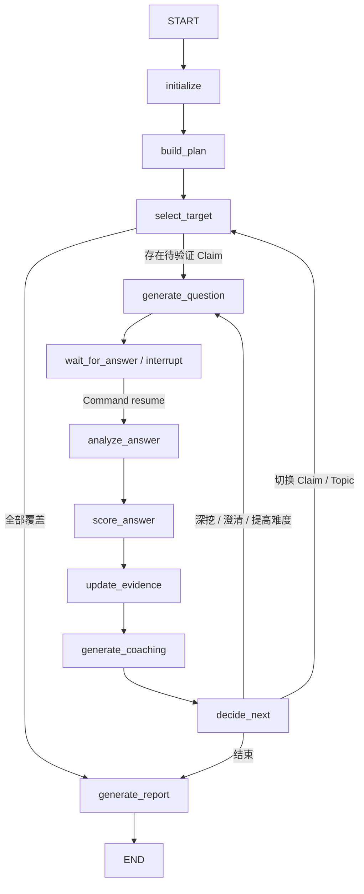
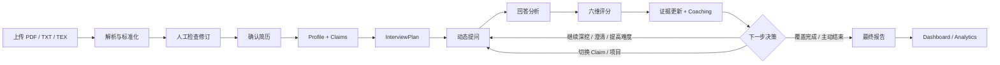

# 问鉴 · Wenjian

> 不止是“问过什么”，更要鉴别“你是否真的做过”。

[GitHub 仓库](https://github.com/liquidweb9/Wenjian)

问鉴是一款以简历事实为起点、以证据验证为主线的 AI 深度面试平台。系统从候选人的真实项目与职责出发，根据每轮回答动态选择继续深挖、澄清、提高难度、切换项目或结束面试，并把判断沉淀为可追溯的能力证据。

它不是固定题库，也不是只生成宽泛建议的通用聊天机器人。核心目标是持续验证简历中的技术主张：候选人是否真正参与、是否理解实现细节、能否解释架构权衡，以及是否具备生产环境中的故障与演进意识。

## 核心能力

### 简历驱动的面试计划

系统支持 PDF、TXT 和 TEX 简历上传，也支持直接提交文本。解析后生成可人工修订和确认的标准化 `ResumeDocument`，进一步构建结构化 Profile，并从项目、工作和研究经历中提取可验证的 Resume Claims。

一个 Claim 不只是关键词，而是带有来源经历、相关技术、目标能力等级、验证点、风险标记、优先级和置信度的面试目标。多个属于同一项目的技术 Claim 会被组合成项目级 Topic，不会机械地变成“一项技术一道题”。

### 可暂停、可恢复的 Agent Loop

面试 Agent 基于 LangGraph 构建，共包含 11 个节点：



LLM 负责理解回答和生成内容，关键路由由代码规则控制。Graph 在 `wait_for_answer` 节点通过 `interrupt()` 暂停，用户提交回答后通过 `Command(resume=...)` 恢复。因此流程既具有动态追问能力，也能被测试、追踪和重建。

### 七级追问深度

问题深度不是简单地增加术语难度，而是逐层逼近真实工程能力：

| 深度 | 关注内容 |
| ---: | --- |
| 1 | 项目背景、目标和个人职责 |
| 2 | 执行流程与端到端链路 |
| 3 | 代码、接口和数据结构 |
| 4 | 原理与设计理由 |
| 5 | 边界、故障、重试和并发 |
| 6 | 备选方案与架构权衡 |
| 7 | 反事实、系统演进和重新设计 |

每轮完成后，规则引擎综合最大轮次、未解决矛盾、回答相关度、实现深度、当前总分、Claim 状态和 Topic 问题预算决定下一步。默认最大轮次为 15，前端允许配置 3–30 轮；这是安全上限，而不是要求系统问满固定数量。

### 证据化分析与六维评分

回答会依次经过内容分析、六维评分、证据更新和 Coaching。评分维度及权重如下：

| 维度 | 权重 | 关注点 |
| --- | ---: | --- |
| 技术正确性 | 25% | 概念、原理和事实是否准确 |
| 实现深度 | 20% | 是否真正理解代码、接口与数据流 |
| 架构与权衡 | 15% | 是否能解释技术选择及其代价 |
| 个人贡献 | 15% | 能否区分团队成果和个人工作 |
| 生产意识 | 15% | 是否考虑故障、监控、性能和恢复 |
| 表达清晰度 | 10% | 能否结构化表达复杂问题 |

系统同时维护 Verification Point、Evidence Item、Contradiction、Topic Coverage 和 Claim Status。Claim 可以处于 `IN_PROGRESS`、`PARTIALLY_VERIFIED`、`VERIFIED` 或 `CONTRADICTORY` 等状态，使最终结论可以回溯到具体问答证据，而不是只保留一个无法解释的总分。

### 回答辅导与能力画像

每题除了评分，还会生成：

- 问题的考察意图；
- 回答中做得好的部分与需要改进的部分；
- 简洁、完整和专家级回答框架；
- 知识缺口和可能的后续追问；
- “预期回答（强回答示例）”。

强回答示例用于展示题目应覆盖的技术点和组织方式，不代表候选人已经实施或陈述了示例中的事实。面试结束后，报告汇总 Overall Score、能力维度、逐题详情、Claim 验证状态、矛盾、覆盖情况、优势、风险和学习建议，并提供 Dashboard 与 Analytics 视图。

## 完整业务链路



## 技术架构

| 层级 | 主要技术 | 职责 |
| --- | --- | --- |
| Web | React 19、TypeScript、Vite、Tailwind CSS 4 | 简历管理、面试工作台、报告与分析 |
| Client State | TanStack Query、Zustand、LocalStorage | 服务端状态、交互状态、草稿与提交恢复 |
| API | FastAPI、Pydantic、SSE | REST API、结构化契约和业务阶段事件 |
| Agent | LangGraph、规则路由、LLM Gateway | 计划、提问、分析、评分、证据和决策循环 |
| Data | SQLAlchemy 2 Async、PostgreSQL、Checkpoint | 简历、问答、评价、报告和执行状态持久化 |
| Quality | Pytest、Ruff、TypeScript、ESLint | 后端测试、静态检查与前端构建验证 |

后端按职责拆分为 API、Interview Graph、Resume、Parser、LLM、Persistence 和 Observability 模块；数据库迁移使用 Alembic。模型通过 OpenAI-compatible API 接入，便于替换具体供应商。

## 实时体验与恢复机制

前端通过 SSE 接收初始化、问题生成、回答接收、分析、评分、Coaching、结束和报告生成等业务事件。它不是 Token 级文本流，而是带业务语义的阶段事件和完整结构化结果。

长耗时处理提供多层恢复：

- SSE 断线采用指数退避重连，最多重试 10 次；
- 新连接首先接收当前问题或结束状态快照；
- 未完成面试每 5 秒轮询详情，作为丢事件和浏览器挂起的兜底；
- 回答草稿以 `interviewId + questionId` 为键保存到 LocalStorage；
- 提交时生成稳定幂等键，刷新后复用，避免重复回答；
- Graph 内存状态丢失后，可根据已持久化的问题、回答、Profile 和 Claims 重建 Checkpoint。

面试房间采用三栏布局：左侧展示历史与进度，中间呈现当前问答、评分和 Coaching，右侧展示当前运行上下文、连接状态与恢复说明。

## 当前实现边界

根据仓库当前文档，以下能力仍有明确限制：

- 鉴权是占位实现，`GET /me` 当前固定返回匿名用户；
- 开发环境默认使用内存 Checkpoint，生产部署需要替换为耐久 Checkpointer；
- SSE Sequence Counter 位于进程内，服务重启后会重新计数；
- 尚未落库的 LLM 中间计算不能保证在进程重启后恢复；
- 报告导出目前支持 JSON 和基础 Markdown，暂不包含 PDF/DOCX；
- Dashboard 与 Analytics 直接聚合已有报告，大数据量下还需要汇总表或缓存；
- 自动化端到端浏览器测试和可访问性审计仍需补充；
- Analysis、Evaluation、Evidence、Coaching 与 Decision 存在数据依赖，当前不能全部并行。

这些限制说明项目已完成可运行的端到端链路，但生产级鉴权、耐久执行、规模化分析和完整 E2E 质量体系仍是后续工程重点。

## 本地运行

环境要求为 Python 3.12+、Node.js 22+、pnpm、PostgreSQL 16，以及一个 OpenAI-compatible LLM API Key。

```bash
# 启动 PostgreSQL
docker compose up -d db

# 安装并启动后端
python -m venv .venv
pip install -e ".[dev]"
alembic upgrade head
uvicorn app.main:app --reload --port 8000

# 启动前端
cd frontend-react
pnpm install
pnpm dev
```

默认访问地址：

- Web UI：`http://localhost:5174`
- OpenAPI / Swagger UI：`http://localhost:8000/docs`
- API 基础路径：`/api/v1`

运行前需要从 `config.env.example` 创建 `config.env`，配置 LLM API 与数据库连接。密钥、数据库密码和私钥不应提交到仓库。

## 项目价值

问鉴展示了如何把 Agent Loop、结构化输出、确定性路由、Human-in-the-loop、证据状态、Checkpoint、SSE、幂等提交和长任务 UX 组合为一条完整产品链路。

对候选人，它提供可执行的反馈与学习路径；对面试官，它提供可审查的追问逻辑和证据链；对 Agent 开发者，它是一个将非确定性模型能力放入确定性工程边界的实践样本。

进一步的工程拆解可参阅 [生产级 Agent 完整案例：Wenjian](../notes/agent-engineering/15-production-case-wenjian)。